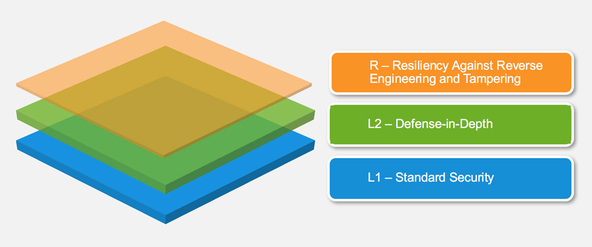

# モバイルアプリケーションセキュリティ検証標準(MASVS)

MASVSはモバイルアプリのセキュリティの信頼レベルを制定するために使用されうる。その要件は以下の目標を考慮して作成された。

* 測定基準(メトリック)としての利用：開発者とアプリケーション所有者によって、既存のアプリを比較できるセキュリティ標準の提供
～この行を編集中です～
* 助言(ガイダンス)としての利用：モバイルアプリの開発とテストのすべての段階で助言(ガイダンス)を提供
* 獲得中の使用：モバイルアプリセキュリティ検証要件のための基準(ベースライン)の提供

## モバイルアプリセキュリティモデル

MASVSは、2つの厳密なセキュリティ検証レベル(L1とL2)を定義し、その上、特定の脅威モデルに適応可能な一連のリバースエンジニアリング耐性要件(MASVS-R)、すなわち柔軟さを定義する。MASVS-L1やMASVS-L2は、汎用的なセキュリティ用件を含んでおり、すべてのアプリ(L1)や高機密データを扱うアプリ(L2)に推奨される。もしクライアント側の脅威を防止することが設計目標であるなら、MASVS-Rは適応可能な追加の保護要件をカバーする。

MASVS-L1を満たすことにより、セキュリティのベストプラクティスに従い、一般的な脆弱性に悩まされないセキュアなアプリケーションであるという結果になる。MASVS-L2は、SSLピンニングなどの更なる多層防御制御を追加し、その結果として、モバイルオペレーティングシステムのセキュリティ制御が損傷を受けておらず、またエンドユーザが潜在的な敵と見なされていないと仮定すれば、より洗練された攻撃に対して耐性のあるアプリとなる。MASVS-Rのソフトウェア保護要件のすべて、もしくはいくつかを満たすことで、エンドユーザに悪意があり、なおかつ/もしくはモバイルOSが不正アクセスされた場合、特定のクライアント側の脅威を妨げるのを手伝う。

**MASVS-Rにリストされ、OWASP Mobile Testing Guideに記載されているソフトウェア保護制御は、究極的にはバイパスされる可能性があり、セキュリティ制御の変わりに決して使用されてはならないことに注意するように。代わりに、それらはMASVSのL1やL2の要件を満たすアプリに脅威特有の更なる防御制御を追加させるつもりである。**

### ドキュメントの構造

MASVSの第一部は、セキュリティモデルと利用可能な検証レベルの記述に続いて、実際に標準を使用する際の方法に関する推奨が含まれている。第二部には、詳細なセキュリティ要件と併せて、検証レベルへのマッピングが記載されている。要件は、技術方針/範囲に基づいて8つのカテゴリ(V1からV8)に分類されている。MASVSとMSTGの至る所で以下の命名が使用されている。

- *要件カテゴリ：* MASVS-Vx。たとえば、MASVS-V2：データ保存とプライバシー
- *要件：* MASVS-Vx.y。たとえば、MASVS-V2.2："機密データはアプリケーションログに書き込まない"

### 詳細な検証レベル

#### MASVS-L1: 標準のセキュリティ(Standard Security)

MASVS-L1を達成するモバイルアプリは、モバイルアプリケーションセキュリティのベストプラクティスに準拠している。それは、コード品質や機密データ処理、モバイル環境との相互作用の条件の基本的な要件を満たしている。セキュリティ制御を検証するために、テストプロセスは実施されなければならない。本レベルは、すべてのモバイルアプリケーションに適切である。

#### MASVS-L2: 多層防御(Defense-in-Depth)

MASVS-L2は、標準要件を超える高度なセキュリティ制御を取り入れる。L2を成し遂げるには、脅威モデルが存在しなければならず、またセキュリティはアプリのアーキテクチャと設計の不可欠な部分でなければならない。本レベルは、モバイルバンキングなどの機密データを処理するアプリケーションに適している。

#### MASVS-R: リバースエンジニアリングと改ざんに対する耐性(Resiliency Against Reverse Engineering and Tampering)

そのアプリは、最先端のセキュリティを持っており、また機密コードやデータを抜き出すための改ざん、改造、リバースエンジニアリングなどの特定の明確に定義されたクライアント側の攻撃に対する耐性もある。そのようなアプリは、ハードウェアのセキュリティ機能や、十分に強力でかつ検証可能なソフトウェア保護技術を活用している。MASVS-Rは、高機密データを処理するアプリケーションに適用され、知的財産の保護やアプリの改ざん防止の手段として役に立つ。

### 推奨用途

アプリは、事前のリスク評価や必要なセキュリティの全体的なレベルに基づいて、MASVS L1やL2に対して検証されうる。L1は、すべてのモバイルアプリに適用できるが、その一方、L2はより機密なデータおよび/または機能を処理するアプリに推奨される。MASVS-R(もしくはその一部)は、適切なセキュリティ検証に加え、リパッキング(再パッキング)や機密データの抽出などの特定の脅威に対する耐性を検証するために適用されうる。

要約すると、以下の検証タイプが利用可能である。

- MASVS-L1
- MASVS-L1+R
- MASVS-L2
- MASVS-L2+R

目標は、フレキシビリティ(柔軟性)を認めることである。異なる組み合わせは、セキュリティと耐性の異なるグレードが反映されている。たとえば、モバイルゲームは、ユーザビリティの理由のため、2要素認証などのMASVS-L2セキュリティ制御を追加することは必要でないかもしれないが、改ざん防止のための強いビジネスニーズが存在する。

#### どの検証タイプを選択するか

MASVS L2要件を実行することは、セキュリティを向上させる一方でそれと同時に、開発コストが増加し、潜在的に、エンドユーザエクスペリエンス(UX：エンドユーザの心地よさ)が悪化する(古典的なトレードオフ)。一般的に、L2はコストに対するリスクの観点から意味を成すときならいつでも、アプリに採用されるべきである(すなわち、機密性や完全性を妥協することによって引き起こされる潜在的な損失が、セキュリティ制御を追加することによって発生するコストよりも高い場合)。リスクアセスメントは、MASVSを適用する前の第一ステップであるべきである。

##### 例

###### MASVS-L1

- すべてのモバイルアプリ。MASVS-L1には、開発コストとユーザエクスペリエンスに妥当な影響を生じることができるセキュリティのベストプラクティスを記載している。より高いレベルの何かを適用する必要のないアプリにMASVS-L1の要件を適用する。

###### MASVS-L2

- 医療業界：個人情報泥棒、不正支払い、もしくはさまざまな詐欺計画に使用されうる個人識別情報を格納するアプリ。アメリカの医療部門では、コンプライアンスの考察は医療保険の携行性と責任に関する法律(HIPAA)プライバシー、セキュリティ、犯罪通知ルール(Breach Notification Rules)、患者安全ルール(Patient Safety Rule)を含んでいる。

- 金融業界：クレジットカード番号、個人情報のような高機密情報にアクセスしたり、ユーザが資金を移動できたりするアプリ。これらのアプリが詐欺を防ぐために更なるセキュリティ制御を行うのは当然である。金融アプリは、PCIデータセキュリティスタンダード(PCI DSS)や、Gramm Leach Bliley Act (GLBA)、Sarbanes-Oxley Act (SOX)を守る必要がある。

###### MASVS L1+R

- IP保護がビジネス目標であるモバイルアプリ。MASVS-Rに記載されている耐性制御は、オリジナルのソースコードを取得したり、改ざん/クラッキングを防止したりするために必要な努力を増加するために使用されうる。

- ゲーム業界：競争の激しいオンラインゲームなどの改造やチート行為を防止するために必要不可欠なゲーム。大量のチーターがユーザの不満を引き起こす元になり、最終的にゲームが失敗する理由となるので、オンラインゲームにおいて、チート行為は重要な問題である。MASVS-Rは、チーターの努力を増加する手助けするために、基本的な耐改ざん機能を提供する。

###### MASVS L2+R

- 金融業界：ユーザに基金の移動を許可するオンラインバンキングアプリ。不正アクセスされたデバイス上のテクニックコードインジェクションと計測はリスクをもたらすような。この場合、MASVS-Rは改ざんを防ぐため、マルウェア作成者の生涯を増やすために使用されうる。

- 設計上、モバイル端末上に機密データを格納する必要があり、なおかつ同時に幅広い端末やオペレーティングシステムのバージョンをサポートしなければならないすべてのモバイルアプリ。この場合、耐性制御は、機密データの抽出を狙う攻撃者の努力を増加するために多層防御手段として使用されうる。
