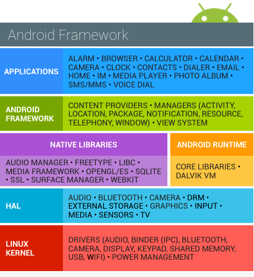
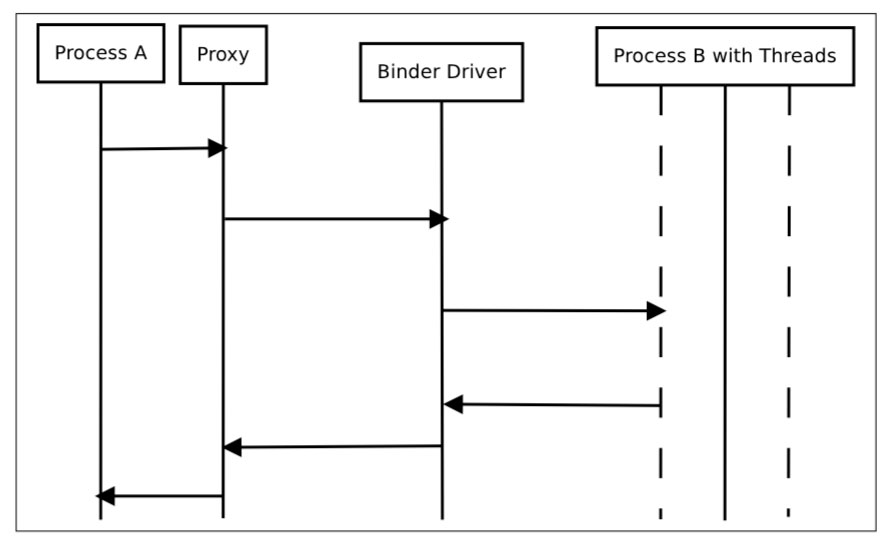

# Android プラットフォームの概要

本セクションは, アーキテクチャの観点からAndroidプラットフォームを紹介する. 以下の4つの主な分野について説明する.

1. Android セキュリティアーキテクチャ
2. Android アプリケーションストラクチャ
3. プロセス間通信 (IPC)
4. Android アプリケーションの公開

Android プラットフォームに関する詳細は公式の[Android developer documentation website](https://developer.android.com/index.html)を参照のこと

## Android セキュリティアーキテクチャ
Androidは, モバイルオペレーションシステム(OS)としてGoogleによって開発されたLinuxベースのオープンソースプラットフォームである. 今日, プラットフォームは, 携帯電話, タブレット, ウェアラブル技術, TV, またその他の「スマート」デバイスのような多種多様な最新技術の基盤である. 一般的なAndroidビルドは, 様々なプレインストールされた(stock)アプリが積まれていおり, Google Play Storeや他のマーケットプレイスを通してサードパーティアプリのインストールをサポートする.

Androidのソフトウェアスタックは, いくつかの異なるレイヤで構成されている. それぞれのレイヤはインタフェイスが定義され, 固有のサービスを提供する.



最も低いレベルでは, AndroidはLinuxカーネルのバリエーションに基づいている. カーネルの上には, ハードウェア抽象化レイヤ(HAL: Hardware Abstraction Layer)が組み込みハードウェアコンポーネントとやり取りするための標準インタフェイスを定義する. いくつかのHAL実装は, 必要な時にAndroidシステムが呼び出す共有ライブラリモジュールにパッケージ化されている. これは, 許可されたアプリケーションがデバイスのハードウェアとやり取りするための基盤である. 例えば, プレインストールされた電話のアプリケーションがデバイスのマイクとスピーカーを使用することを許可する.

Androidアプリケーションは, 通常Javaで記述され, 従来のJavaバイトコードとは若干異なるDalvikバイトコードにコンパイルされる. Dalvikバイトコードは, 初めにJavaコードをコンパイルして.classファイルを生成し, 次にdxツールを用いてJVMバイトコードをDalvik .dex形式に変換する.


最新バージョンのAndroidは, Androidランタイム(ART)上でこのバイトコードを実行する. ARTは, AndroidのオリジナルランタイムであるDalvik Virtual Machineの後継である. DalvikとARTの主な違いは, バイトコードの実行方法の違いである.

Dalvikでは, 実行時にバイトコードはマシンコードに変換される. これはjust-in-time(JIT)コンパイルとして知られているプロセスである. JITコンパイルは, パフォーマンスに悪影響を与える. アプリが実行される度にコンパイルが実行されなければならない. パフォーマンスを向上させるために, ARTはahead-of-time(AOT)コンパイルを導入した. その名前が示す通り, アプリは初めて実行される前にプリコンパイルされる. このプリコンパイルされたマシンコードは, 以降のすべての実行に使用される. AOTは, 消費電力を減少させながら, パフォーマンスを２倍に向上させる.

Androidアプリは, ハードウェアリソースに直接アクセスすることはできず, それぞれのアプリは, 各自のサンドボックス内で実行される. これにより, リソースやアプリを正確に制御することができる. 例えば, あるアプリがクラッシュしたとしても, デバイスで実行している他のアプリケーションに影響を与えない. 同時に, Androidランタイムは, アプリに割り当てられたシステムリソースの最大数を制御し, 1つのアプリが大量のリソースを占有することを防止する.

### Android ユーザとグループ
AndroidオペレーティングシステムはLinuxベースであるけれども, 他のUnixライクなシステムが実装しているのと同じ方法でユーザアカウントを実装していない. Androidでは, サンドボックスアプリへのLinuxカーネルのマルチユーザサポート: いくつかの例外を除いて, それぞれのアプリは, まるで独立したLinuxユーザの下で動作しているかのように実行し, 効果的に他のアプリや残りのオペレーティングシステムから分離される.  

[system/core/include/private/android_filesystem_config.h](http://androidxref.com/7.1.1_r6/xref/system/core/include/private/android_filesystem_config.h)ファイルは, システムプロセスが割り当てられた事前に定義されているユーザとグループのリストが含まれている. 他のアプリケーションのUID(ユーザID)は, 後者がインストールされているときに追加される. 詳細は,  Bin ChenのAndroidサンドボックスに関する[ブログ記事](https://pierrchen.blogspot.mk/2016/09/an-walk-through-of-android-uidgid-based.html)を参照のこと.

例えば, AndroidのNougatでは以下のようなシステムユーザが定義されている.

```
    #define AID_ROOT             0  /* traditional unix root user */

    #define AID_SYSTEM        1000  /* system server */
	...
    #define AID_SHELL         2000  /* adb and debug shell user */
	...
    #define AID_APP          10000  /* first app user */
	...
```

## Androidアプリケーションストラクチャ

### オペレーティングシステムとの通信
Androidアプリは, 高水準のJava APIを提供する抽象レイヤであるAndroid Frameworkを通してシステムサービスとやり取りする. これらのサービスの大部分は, 通常のJavaメソッド呼び出しによって呼び出され, バックグラウンドで実行しているシステムサービスへのIPC呼び出しに変換される. システムサービスの例を以下に記す.

    - 接続性(Connectivity) (Wi-Fi, Bluetooth, NFCなど)
    - Giles
    - カメラ(Cameras)
    - 地理位置情報(Geolocation) (GPS)
    - マイク(Microphone)

また, フレームワークは暗号などの一般的なセキュリティ機能も提供する.

APIの仕様は, 新しいAndroidがリリースされる度に変わる. 重大なバグ修正やセキュリティパッチは, 通常旧バージョンにも適用される. 執筆時点でサポートされている一番古いAndroidバージョンは, API Level 19の4.4(KitKat), そして最新のAndroidバージョンは, API Level 25の7.1(Nougat)である.

特筆すべきAPIバージョン


- Android 4.2 Jelly Bean (API 16) in November 2012 (introduction of SELinux)
- Android 4.3 Jelly Bean (API 18) in July 2013 (SELinux became enabled by default)
- Android 4.4 KitKat (API 19) in October 2013 (several new APIs and ART introduced)
- Android 5.0 Lollipop (API 21) in November 2014 (ART used by default and many other features added)
- Android 6.0 Marshmallow (API 23) in October 2015 (many new features and improvements, including granting; detailed permissions setup at run time rather than all or nothing during installation)
- Android 7.0 Nougat (API 24-25) in August 2016 (new JIT compiler on ART)
- Android 8.0 O (API 26) beta (major security fixes expected)

### アプリフォルダストラクチャ
インストールされたAndroidアプリは`/data/app/[package-name]`に位置している. 例えば, YouTubeアプリの場合は以下のとおりである.

```bash
/data/app/com.google.android.youtube-1/base.apk
```

Androidパッケージキット(APK)ファイルは, 同梱しているアプリを実行するために必要なコードとリソースを含んでいるアーカイブである. このファイルは, 開発者によって作成されたオリジナルの署名済みのアプリパッケージと完全に一致している. 実際には, 以下のディレクトリストラクチャを持つZIPアーカイブである.

```
$ unzip base.apk
$ ls -lah
-rw-r--r--   1 sven  staff    11K Dec  5 14:45 AndroidManifest.xml
drwxr-xr-x   5 sven  staff   170B Dec  5 16:18 META-INF
drwxr-xr-x   6 sven  staff   204B Dec  5 16:17 assets
-rw-r--r--   1 sven  staff   3.5M Dec  5 14:41 classes.dex
drwxr-xr-x   3 sven  staff   102B Dec  5 16:18 lib
drwxr-xr-x  27 sven  staff   918B Dec  5 16:17 res
-rw-r--r--   1 sven  staff   241K Dec  5 14:45 resources.arsc
```

- AndroidManifest.xml: アプリのパッケージ名, ターゲットのAPIバージョンと最小のAPIバージョン, アプリの設定, コンポーネント, ユーザが承認したパーミッションなどの定義を含む
- META-INF: アプリのメタデータを含む
  - MANIFEST.MF: アプリリソースのハッシュを保存
  - CERT.RSA: アプリの証明書
  - CERT.SF: MANIFEST.MFファイル内の対応する行のリソースとSHA-1ダイジェストのリスト
- assets: AssetManagerが読み取ることが可能なアプリアセット(XMLファイル, JavaScriptファイル, 画像などのAndroidアプリで使用されるファイル)を含むディレクトリ
- classes.dex: Dalvik virtual machine/Android Runtimeが処理可能なDEXファイル形式でコンパイルされたクラス. DEXは, Dalvik Virtual MachineのJavaバイトコードである. スモールデバイスに最適化されている.
- lib: APKの一部であるライブラリ(例えば, Android SDKの一部ではないサードパーティのライブラリ)を含んでいるディレクトリ
- res: resources.arscにコンパイルされていないリソースを含むディレクトリ
- resources.arsc: レイアウトのためのXMLファイルなどのプリコンパイルされたリソースを含むファイル

標準の`unzip`ユーティリティを用いてアーカイブを展開した場合, いくつかのファイルが読み取れないままになることに注意しなさい. `AndroidManifest.XML`は, テキストエディタでは読み取れないバイナリXML形式にエンコードされる. また, アプリのリソースは単一のアーカイブファイルにまだパッケージ化されている. Androidアプリパッケージをアンパックするためのより良い方法は, [apktool](https://ibotpeaches.github.io/Apktool/)を用いることである. デフォルトのコマンドラインフラグと共に実行すると, apktoolは自動的にManifestファイルをテキストベースのXML形式に出コードし, ファイルリソースを抽出する(また, DEXファイルをSmaliコードに逆アセンブルする. これは後で説明する機能である. ).

```bash
$ apktool d base.apk
I: Using Apktool 2.1.0 on base.apk
I: Loading resource table...
I: Decoding AndroidManifest.xml with resources...
I: Loading resource table from file: /Users/sven/Library/apktool/framework/1.apk
I: Regular manifest package...
I: Decoding file-resources...
I: Decoding values */* XMLs...
I: Baksmaling classes.dex...
I: Copying assets and libs...
I: Copying unknown files...
I: Copying original files...
$ cd base
$ ls -alh
total 32
drwxr-xr-x    9 sven  staff   306B Dec  5 16:29 .
drwxr-xr-x    5 sven  staff   170B Dec  5 16:29 ..
-rw-r--r--    1 sven  staff    10K Dec  5 16:29 AndroidManifest.xml
-rw-r--r--    1 sven  staff   401B Dec  5 16:29 apktool.yml
drwxr-xr-x    6 sven  staff   204B Dec  5 16:29 assets
drwxr-xr-x    3 sven  staff   102B Dec  5 16:29 lib
drwxr-xr-x    4 sven  staff   136B Dec  5 16:29 original
drwxr-xr-x  131 sven  staff   4.3K Dec  5 16:29 res
drwxr-xr-x    9 sven  staff   306B Dec  5 16:29 smali
```

- AndroidManifest.xml: デコードされたManifestファイルで, テキストエディタで開いて編集することが可能
- apktool.yml: apktoolの出力に関する情報を含むファイル
- original: MANIFEST.MF fileを含むフォルダで, JARファイルに含まれるファイルに関する情報を含む
- res: アプリのリソースを含むディレクトリ
- smali: Smali内の逆アセンブルされたDalvikバイトコードを含むディレクトリ.SmaliはDalvik実行可能で人間が読み取り可能な表記法である. また, すべてのアプリは, 実行中に生成されたデータを格納するためのデータディレクトリも持っている. このディレクトリは, `/data/data/[package-name]`にあり, 以下のストラクチャを持っている.

```bash
drwxrwx--x u0_a65   u0_a65            2016-01-06 03:26 cache
drwx------ u0_a65   u0_a65            2016-01-06 03:26 code_cache
drwxrwx--x u0_a65   u0_a65            2016-01-06 03:31 databases
drwxrwx--x u0_a65   u0_a65            2016-01-10 09:44 files
drwxr-xr-x system   system            2016-01-06 03:26 lib
drwxrwx--x u0_a65   u0_a65            2016-01-10 09:44 shared_prefs
```

- **cache**: この場所は, データキャッシュに使用される. 例えば, WebViewキャッシュはこのディレクトリでみられる
- **code_cache**: キャッシュされたコードを格納するために設計されたファイルシステムのアプリケーション固有のキャッシュディレクトリの場所. Lollipop以降のAndroidバージョンを実行している端末上では, アプリやプラットフォーム全体がアップグレードされる時に, システムはこの場所に保存されているすべてのファイルを削除する
- **databases**: このフォルダは, 実行時にアプリによって生成されたSQLiteデータベースファイル(例えば, ユーザデータファイル)を格納する
- **files**: このフォルダは, アプリによって生成された普通のファイルを格納する
- **lib**: このフォルダは, C/C+++で記述されたネイティブライブラリを格納する. これらのライブラリは, .soや .dll(x86サポート)を含むいくつかのファイル拡張子の1つを持つことができる. このフォルダは, アプリがネイティブライブラリを持っているプラットフォームのための以下のようなサブフォルダを含んでいる.
   * armeabi: すべてのARMベースのプロセッサのためのコンパイルされたコード
   * armeabi-v7a: バージョン7以上のみのすべてのARMベースのプロセッサのためのコンパイルされたコード
   * arm64-v8a: バージョン8以上のみのすべてのARMベースのプロセッサのためのコンパイルされたコード
   * x86: x86プロセッサのみのためのコンパイルされたコード
   * x86_64: x86_64プロセッサのみのためのコンパイルされたコード
   * mips: MIPSプロセッサのためのコンパイルされたコード
- **shared_prefs**: このフォルダは, [SharedPreferences APIs]( https://developer.android.com/training/basics/data-storage/shared-preferences.html)を通して保存された値を格納するXMLファイルを含む

#### 通常のアプリケーションのためのLinux UID/GID
Androidはアプリを分離するために, Linuxのユーザ管理を活用する. このアプローチは, 同一ユーザによってよく多数のアプリが実行されている従来のLinux環境のユーザ管理方法と異なっている. Androidは, それぞれのAndroidアプリに対し, 固有のUIDを生成し, 独立したプロセスでアプリを実行する. その結果として, それぞれのアプリは地震のリソースにだけアクセスすることが可能となる. この保護はLinuxカーネルによって強制されている.

一般的に, アプリは10000～99999の範囲でUIDを割り当てられる. Androidアプリは, それぞれのUIDに基づいたユーザ名を受け取る. 例えば, UID 10188を持っているアプリは, ユーザ名 `u0_a188`を受け取る. アプリが必要とするパーミッションが許可された場合, 同様のグループIDがアプリのプロセスに追加される. 例えば, 以下のアプリのユーザIDは10188である. それはグループID 3003(inet)に属している. そのグループは, android.permission.INTERNET パーミッションに関連している. `id`コマンドの出力は, 以下の通りである.

```
$ id
uid=10188(u0_a188) gid=10188(u0_a188) groups=10188(u0_a188),3003(inet),9997(everybody),50188(all_a188) context=u:r:untrusted_app:s0:c512,c768
```

グループIDとパーミッションの関係は, [framework/base/data/etc/platform.xml](http://androidxref.com/7.1.1_r6/xref/frameworks/base/data/etc/platform.xml)ファイルで定義されている

```
<permission name="android.permission.INTERNET" >
	<group gid="inet" />
</permission>

<permission name="android.permission.READ_LOGS" >
	<group gid="log" />
</permission>

<permission name="android.permission.WRITE_MEDIA_STORAGE" >
	<group gid="media_rw" />
	<group gid="sdcard_rw" />
</permission>
```

### アプリサンドボックス
アプリは, デバイス上の他のアプリからアプリデータとコード実行を分離したAndroidアプリケーションサンドボックスで実行される. この分離は, セキュリティレイヤをもたらす.

新規アプリをインストールすると, アプリパッケージにちなんで名付けられた新たなディレクトリ(`/data/data/[package-name]`)が生成される. このディレクトリは, アプリのデータを保持する. Linuxディレクトリパーミッションは, アプリの固有UIDを持っているときのみ, ディレクトリに対して読み取りや書き込みを行うことができるようなセットである.


我々は, `/data/data`フォルダのファイルシステムパーミッションを調べることによって, このことを確かめることができる. 例えば, Google ChromeとCalenderでそれぞれ1つのディレクトリが割り当てられ, 異なるユーザアカウント下で実行されていることを確認することができる.


```
drwx------  4 u0_a97              u0_a97              4096 2017-01-18 14:27 com.android.calendar
drwx------  6 u0_a120             u0_a120             4096 2017-01-19 12:54 com.android.chrome
```

アプリが一般的なサンドボックスを共有するようにしたい開発者は, サンドボックスを回避することができる. 2つのアプリが同じ証明書で署名されていて, 同じユーザIDを明確に共有している(AndroidManifest.xmlファイルにsharedUserIdを持っている)場合は, それぞれがほかのデータディレクトリにアクセスすることができる. これをNFCアプリで実行するためには, 以下を参考にしなさい.

```
<manifest xmlns:android="http://schemas.android.com/apk/res/android"
  package="com.android.nfc"
  android:sharedUserId="android.uid.nfc">
```

#### Zygote
`Zygote`プロセスは, [Androidの初期化](https://github.com/dogriffiths/HeadFirstAndroid/wiki/How-Android-Apps-are-Built-and-Run)中に起動する. Zygoteは, アプリを起動するためのシステムである. Zygoteプロセスは, アプリが必要とするすべてのコアライブラリを含んでいる「基盤」プロセスである. 起動するとZygoteは, ソケット`/dev/socket/zygote`を開き, ローカルクライアントからのコネクションをリッスンする. コネクションを受け取ったら, 新たなプロセスをフォークし, その後アプリ固有のコードをロードして実行する.

#### アプリライフサイクル
Androidでは, アプリプロセスの有効期間はオペレーティングシステムによって制御されている. 新たなLinuxプロセスは, アプリコンポーネントが開始され, 同じアプリがまだ他のコンポーネントを実行していないときに生成される. 後者がもはや不要である時, もしくはより重要なアプリを実行するためにメモリの再利用が必要な時に, Androidはこのプロセスを殺す可能性がある. プロセスを殺す決定は, 主にプロセスとユーザのやり取りの状態に関連している. 一般的に, プロセスは以下に示す4つの状態のうちの1つである.

- フォアグラウンドプロセス(例えば, 画面の最前面で実行しているアクティビティ, もしくは実行中のBroadcastReceive)
- 可視プロセスは, ユーザが把握しているプロセスなので, それを殺すことはユーザエクスペリエンスに著しい悪影響をもたらすかもしれない. 1つの例としては, 画面上でユーザに表示されるが, フォアグラウンドではないようなアクティビティを実行することである.
- サービスプロセスは, `startService`メソッドで開始されたサービスをホストするプロセスである. これらのプロセスは直接ユーザには見えないが, 一般的にユーザが気にするプロセスなので(バックグラウンドのネットワークのデータアップロード/ダウンロードなど), すべてのフォアグラウンドプロセスや可視プロセスを保持するためのメモリが不足しない限り, システムは常にこのようなプロセス実行を維持するだろう.
- キャッシュされたプロセスは, 現在は必要とされていないプロセスなので, システムはメモリが必要な時に自由に殺すことができる. アプリは, 数多くのイベントに反応するコールバックメソッドを実装しなければならない. 例えば, `onCreate`ハンドラは, アプリプロセスが初めて生成されたときに呼び出される. 他のコールバックメソッドとしては, `onLowMemory`, `onTrimMemory`, `onConfigurationChanged`がある.

#### マニフェスト
すべてのアプリは, バイナリXML形式でコンテンツを埋め込むマニフェストファイルを持っている. このファイルの標準の名前は, AndroidManifest.xmlである. アプリのAPKファイルのルートディレクトリに位置している.

マニフェストファイルには, アプリストラクチャ, コンポーネント(アクティビティ, サービス, コンテントプロバイダ, インテントレシーバー), 要求されたパーミッションが記述されている. また, アプリのアイコン, バージョンナンバー, テーマなどの一般的なアプリのメタデータも含まれている. このファイルは, 互換性のあるAPI(最小, ターゲット, 最大のSDKバージョン)および[インストールすることができる(内部や外部)ストレージの種類](https://developer.android.com/guide/topics/data/install-location.html)などの他の情報がリストされている場合もある.

以下に, パッケージ名(慣習では逆にされたURLだが, 任意の文字列許容されている)を含むマニフェストファイルの例がある. また, アプリのバージョン, 関連するSDK, 必要なパーミッション, 公開されたコンテントプロバイダ, インテントフィルタで使用されるブロードキャストレシーバー, アプリとそのアクティビティの概要もリストされている.

```
<manifest
	package="com.owasp.myapplication"
	android:versionCode="0.1" >

	<uses-sdk android:minSdkVersion="12"
		android:targetSdkVersion="22"
		android:maxSdkVersion="25" />

	<uses-permission android:name="android.permission.INTERNET" />

	<provider
		android:name="com.owasp.myapplication.myProvider"
		android:exported="false" />

	<receiver android:name=".myReceiver" >
		<intent-filter>
			<action android:name="com.owasp.myapplication.myaction" />
		</intent-filter>
	</receiver>

	<application
		android:icon="@drawable/ic_launcher"
		android:label="@string/app_name"
		android:theme="@style/Theme.Material.Light" >
		<activity
			android:name="com.owasp.myapplication.MainActivity" >
			<intent-filter>
				<action android:name="android.intent.action.MAIN" />
			</intent-filter>
		</activity>
	</application>
</manifest>
```

利用可能なマニフェストオプションの全リストは, 公式の[Androidマニフェストファイルドキュメント](https://developer.android.com/guide/topics/manifest/manifest-intro.html)を参照のこと.

#### アプリコンポーネント
アンドロイドアプリは, いくつかの高水準コンポーネントで作られている. 主なコンポーネントは, 以下の通りである.


- アクティビティ(Activities)
- フラグメント(Fragments)
- インテント(Intents)
- ブロードキャストレシーバー(Broadcast receivers)
- コンテントプロバイダとサービス(Content providers and services)

これらの全要素は, APIを通して利用可能な既に定義されたクラスの形で, Androidオペレーティングシステムによって提供される.

#### アクティビティ
アクティビティは, アプリの目に見える部分を生成する. 画面ごとに1つのアクティビティが存在するので, 3つの異なる画面を持つアプリは, 3つの異なるアクティビティを実装している. アクティビティは, Activityクラスを拡張することによって宣言される. それらは,  fragments, view, layoutのすべてのユーザインタフェイス要素を含んでいる.

それぞれのアクティビティは, 以下の構文によるアプリマニフェスト内での宣言が必要である.

```
<activity android:name="ActivityName">
</activity>
```

マニフェストで宣言されていないアクティビティは, 表示することができず, それらを立ち上げようとすると, 例外が発生する.

アプリと同様に, アクティビティは自身のライフサイクルがあり, 処理するためにはシステム変更を監視する必要がある. アクティビティは, アクティブ, 一時停止, 停止, 非アクティブのいずれかの状態である. これらの状態は, Androidオペレーティングシステムによって管理されている. その結果, アクティビティは以下のイベントマネージャを実装することができる.

- onCreate
- onSaveInstanceState
- onStart
- onResume
- onRestoreInstanceState
- onPause
- onStop
- onRestart
- onDestroy

アプリはすべてのイベントマネージャを明確には実装しないかもしれないが, この場合はデフォルトのアクションがとられる. 通常, 少なくとも`onCreate`マネージャはアプリ開発者によってオーバーライドされる. これは, 大多数のユーザインタフェイスコンポーネントが宣言され, 初期化される方法である. `onDestroy`は, リソース(ネットワーク接続やデータベース接続)が明示的にリリースされなければならない時, もしくはアプリをシャットダウンする時に特別なアクションが発生しなければならない時にオーバーライドされるかもしれない.

#### フラグメント
フラグメントは, アクティビティ内で動きやユーザインタフェイスの一部を表す. フラグメントは, Honeycomb 3.0のバージョン(API level 11)でAndroidに導入された.

フラグメントは, 再利用性と異なる画面サイズへの適応を手助けするためにインタフェイスの一部をカプセル化することを目的としている. フラグメントは, 必要とされるコンポーネント(それらは自身のレイアウト, ボタンなどを持っている)すべてに含まれている自立したエンティティである. しかしながら, それらは有益なアクティビティに統合されなければならない. フラグメントは, それ自身では存在することができない. それらは実装されているアクティビティのライフサイクルに関連する自身のライフサイクルを持っている.

フラグメントは, 自身のライフサイクルを持っているため, Fragmentクラスには, 再定義や拡張可能なイベントマネージャが含まれている. これらのイベントマネージャは, onAttach, onCreate, onStart, onDestroy, onDetachが含まれていた. 他のものもいくつか存在するため, 詳細については[Android Fragment specification](https://developer.android.com/reference/android/app/Fragment.html)を参照のこと.

フラグメントは, Androidによって提供されたFragmentクラスを拡張することによって容易に実装することができる.

```Java
public class myFragment extends Fragment {
	...
}
```

アクティビティによって決まるため, マニフェストファイルで宣言する必要がない.

フラグメントを管理するために, アクティビティはフラグメントマネージャ(FragmentManagerクラス)を使用することができる. このクラスは, 関連するフラグメントの発見, 追加, 削除, 置換を簡単にする.

フラグメントマネージャは, 以下を通して生成されうる.


```Java
FragmentManager fm = getFragmentManager();
```

フラグメントは, 必ずしもユーザインタフェイスを持っていない. それらはアプリのユーザインタフェイスに関するバックグラウンド処理を管理するための便利で効率の良い方法である. フラグメントは, たとえアクティビティが破壊されたとしても, システムがその状態を維持できるように永続的に宣言されるかもしれない.

#### プロセス間通信
既に学んだように, すべてのAndroidプロセスは, 自身のサンドボックスアドレス空間を持っている. プロセス間通信機能によって, アプリが信号とデータを安全に変換することができる. デフォルトのLinux IPC(プロセス間通信)機能に頼る代わりに, AndroidのIPCはOpenBinderのカスタム実装であるBinderに基づいている. ほとんどのAndroidシステムのサービスとすべての高水準IPCサービスは, Binderに頼っている.

Binderの用語は, 以下を含む多くの異なるものを表している.

- Binder Driver: カーネルレベルのドライバ
- Binder Protocol: Binder Driverとの通信に利用される低水準のioctlベースのプロトコル
- IBinder Interface: Binder Objectが実装する明確に定義された動作
- Binder object: IBinder Interfaceの一般的な実装
- Binder service: Binder objectの実装(例えば, ロケーションサービス, センサーサービス)
- Binder client: Binder serviceを利用するオブジェクト

Binderフレームワークは, クライアント－サーバ間の通信モデルを含んでいる. IPCを使用するために, アプリはプロキシオブジェクト内のIPCメソッドを呼び出す. プロキシオブジェクトは, ユーザが気付くことなく, *parcel* の中にコールパラメータを整理(*marshall*)し, キャラクタデバイス(/dev/binder)として実装されたBinderサーバにトランザクションを送信する. サーバは受信要求を処理するためのスレッドプールを保持し, 宛先オブジェクトにメッセージを配信する. クライアントアプリの視点から, このすべてが通常のメソッド呼び出しのように思われる. 最も難しくて手間がかかる部分のすべては, Binderフレームワークによって行われる.


*Binderの概要. 画像のソース: [Android Binder by Thorsten Schreiber](https://www.nds.rub.de/media/attachments/files/2011/10/main.pdf)*

他のアプリケーションがバインドすることを許可するサービスは, *bound service* と呼ばれている. これらのサービスは, クライアントにIBinder interfaceを提供しなければならない. 開発者は, リモートサービスのためのインタフェイスを記述するために, Android Interface Descriptor Language(AIDL)を使用する.

Servicemanagerは, システムサービスの登録と検索を管理するシステムデーモンである. それは, 登録されているサービスすべてのname/Binderのペアのリストを保持する. サービスは`addService`で追加され, `android.os.ServiceManager`内の静的な`getService`メソッドとともに名前で読み出される.

```
  public static IBinder getService(String name)
```

`service list`コマンドで, システムサービスのリストを問い合わせることができる.

```
$ adb shell service list
Found 99 services:
0 carrier_config: [com.android.internal.telephony.ICarrierConfigLoader]
1 phone: [com.android.internal.telephony.ITelephony]
2 isms: [com.android.internal.telephony.ISms]
3 iphonesubinfo: [com.android.internal.telephony.IPhoneSubInfo]
```

#### インテント
Intent messagingは, Binderの上にビルドされた非同期通信フレームワークである. このフレームワークは, ポイント・ツー・ポイントとPub/Subの両方のメッセージングを許可する. Intentは, ほかのアプリコンポーネントからアクションを要求するために使用されうるメッセージングオブジェクトである. インテントは, いくつかの方法でコンポーネント間通信を手助けするが, 以下のような3つの基本的な使用例がある.

- アクティビティの開始
  - アクティビティは, アプリで1つの画面を描写する. `startActivity`にインテントを渡すことでアクティビティの新たなインスタンスを起動することができる. インテントはアクティビティを表現し, 必要なデータを運ぶ.
- サービスの開始
  - サービスは, ユーザインタフェイスなしでバックグラウンドの操作を実行するコンポーネントである.  Android 5.0(API Level 21)以降なら, JobSchedulerでサービスを起動することができる.  
- ブロードキャストの配信
  - ブロードキャストは, どんなアプリでも受け取ることができるメッセージである. システムは, システムの起動, 充電の初期化を含むシステムイベントのためにブロードキャストを配信する. `sendBroadcast`や`sendOrderedBroadcast`にインテントを渡すことでブロードキャストを他のアプリに配信することができる.

インテントは, アプリとコンポーネント間でメッセージを送信するためのコンポーネントである. アプリは自身のコンポーネント(例えば, アプリ内で新たなアクティビティを開始するため), 他のアプリ, オペレーティングシステムに情報を送信するためにインテントを使用できる. インテントは, アクティビティとサービスの開始, 与えられたデータに対するアクションの実行, システム全体へのメッセージのブロードキャストをするために使用できる.

インテントには2種類が存在する. 明示的インテントは, 起動されるコンポーネントを指定する(完全修飾クラス名). 例えば以下のような感じで.

```Java
    Intent intent = new Intent(this, myActivity.myClass);
```

暗黙的インテントは, 与えられたデータセット(以下の例では, "[http://www.example.com](http://www.example.com)")で与えられたアクションを実行するためにOSに送信される. どのアプリやクラスが対応するサービスを実行するかを決めるのはシステム次第である.

```Java
    Intent intent = new Intent(Intent.MY_ACTION, Uri.parse("http://www.example.com"));
```

intent filterは, コンポーネントが受信したいインテントのタイプを明記するアプリマニフェストファイル内の要素である. 例えば, アクティビティのためのintent filterを宣言することによって, 他のアプリが特定種類のインテントからアクティビティを直接起動できるようにする. 同様に, intent filterを宣言していない場合, アクティビティは明示的インテントのみで起動することができる.

Androidは, アプリ(受信コールやSMSなど)に重要な電力供給情報(バッテリー残量が少ないなど), ネットワークの変更(コネクションの切断など)のようなメッセージをブロードキャストするためにインテントを使用する. 余分なデータが(`putExtra`や`getExtra`を通して)インテントに追加される場合がある.

以下に記載しているのがオペレーティングシステムによって送信されるインテントのショートリストである. すべての定数はインテントクラスで定義されていて, そのリストの全体は公式のAndroidドキュメントに存在する.

- ACTION_CAMERA_BUTTON
- ACTION_MEDIA_EJECT
- ACTION_NEW_OUTGOING_CALL
- ACTION_TIMEZONE_CHANGED

セキュリティとプライバシーを向上させるため, オペレーティングシステムの残りの部分に送信することなくアプリ内のインテントを送受信するためにLocal Broadcast Managerが使用される. これは機密データやプライベートデータ(例えば地理位置情報データ)がアプリ境界から離れないようにするために非常に便利である.

#### ブロードキャストレシーバ
ブロードキャストレシーバは, アプリに他のアプリやシステム自身からの通知の受信を許可するコンポーネントである. それと, アプリはイベント(内部の, 他のアプリによって開始された, オペレーティングシステムによて開始された)に応答できる. それらは一般的にユーザインタフェイスのアップデート, サービスの開始, コンテンツのアップデート, ユーザ通知の作成に使用される.

ブロードキャストレシーバは, アプリのマニフェストファイル内で宣言されなければならない. マニフェストファイルは, 受信者がリッスンすべきアクションを指し示すためにブロードキャストレシーバとインテントフィルタの関連性を明記しなければならない. ブロードキャストレシーバが宣言されていない場合, アプリはブロードキャストされたメッセージをリッスンしない. しかしながら, 関連するインテントが立ち上がるとシステムが自動的にアプリを起動するため、インテントを受け取るためにアプリを実行している必要はない.

マニフェスト内のインテントフィルタを備えたブロードキャストレシーバ宣言の例を以下に示す.

```
	<receiver android:name=".myReceiver" >
		<intent-filter>
			<action android:name="com.owasp.myapplication.MY_ACTION" />
		</intent-filter>
	</receiver>
```

暗黙的インテントの受信後, Androidはフィルタに規定のアクションを登録したすべてのアプリをリストする. 1つ以上のアプリが同じアクションに登録されている場合, Androidはユーザに利用可能なアプリのリストから選択するように指示する.

ブロードキャストレシーバの面白い特徴は, 優先度が割り当てられているということである. このように, インテントは優先度に従って認可されたすべての受信者に配信される.

ローカルブロードキャストマネージャは, 内部アプリからのみインテントが受信されたか, 他アプリからのインテントが破棄されたかの確認に使用できる. これはセキュリティを向上するのに非常に便利である.

#### コンテントプロバイダ
Androidは恒久的にデータを保存するためにSQLiteを使用する. Linux同様にデータはファイルに保存される. SQLiteは, モバイルでの使用に最適な, あまり処理能力を必要としない軽量で効率的なオープンソースのリレーショナルデータストレージ技術である. 特定のクラス(Cursor, ContentValues, SQLiteOpenHelper, ContentProvider, ContentResolverなど)を持つAPI全体で利用可能です. SQLiteは, アプリの一部であるため, 単独のプロセスとして実行されない. デフォルト設定で, 特定アプリに所属しているデータベースは, このアプリにだけアクセス可能である. しかしながら, コンテントプロバイダは, データソース(データベース, フラットファイルを含む)を抽象化するための重要なメカニズムを提供する. また, ネイティブアプリを含むアプリ間でデータを共有するための標準的かつ効率的なメカニズムを提供する. 他アプリにアクセス可能となるために, コンテントプロバイダは, データを共有するアプリのマニフェストで明確な宣言を必要とする. コンテントプロバイダが宣言されていない限り, コンテントプロバイダはエクスポートされず, コンテントプロバイダを生成したアプリによって呼び出されるだけである.

コンテントプロバイダは, content://モデルを使用するURIアドレッシングスキームを通して実装される. ソース(SQLiteデータベース, フラットファイルなど)の種類にかかわらず, アドレッシングスキームは常に同じであり, それによってソースを抽象化し, 開発者に固有のスキームを提供する. コンテントプロバイダは, 作成, 読み取り, 更新, 削除のような標準的なデータベース処理のすべてを提供する. それは, マニフェストファイルで適切な権限を持つアプリなら, 他アプリからデータを操作できるということを意味している.

#### サービス
サービスは, ユーザインタフェイスを提示することなく, バックグラウンド(データ処理, インテントの実行, 通知など)でタスクを実行するAndroid OSコンポーネント(サービスクラスに基づく)である. サービスは長期間プロセスを実行するように意図されている. システム優先度は, アクティブなアプリの優先度より低くく, 非アクティブなアプリの優先度より高い. したがって, システムがリソースを必要とするときは殺される可能性は低くく, 十分なリソースが利用可能になったときは自動的に再起動するよう設定されている. アクティビティはメインのアプリスレッドで実行される. それらは, 非同期タスクを実行するための重要な候補である.

#### パーミッション
Androidアプリはサンドボックスにインストールされ, 最初はユーザ情報とシステムコンポーネント(カメラやマイクなど)にアクセスできないので, Androidはアプリが要求できるあるタスクのために事前に定義されたパーミッションのセットをシステムに提供する. 例えば, アプリが電話のカメラを使用したいなら, `android.permission.CAMERA`パーミッションを要求する必要がある. Marshmallow(API 23)より前では, アプリが要求するすべてのパーミッションは, インストール時に許可されていた. Android Marshmallow以降から, アプリ実行中にユーザがパーミッション要求を承認しなければならないものがある.

###### プロテクションレベル
Androidパーミッションは, 提供されるプロテクションレベルに基づいてランク付けされ, 4つの異なるカテゴリに分類されている.

- Normal: より低いレベルの保護. 他のアプリ, ユーザ, システムへのリスクを最小限にした状態で, 分離されたアプリケーションレベルの機能へのアクセスをアプリに与える. アプリインストール中に許可され, デフォルトのプロテクションレベルである. 例: `android.permission.INTERNET`
- Dangerous: 子のパーミッションは, ユーザのプライバシーやユーザのデバイスの通常操作に影響を与えるかもしれないアクションを実行することをアプリに許可する. このパーミッションのレベルは, インストール中に許可されないかもしれない. アプリがこのパーミッションを持つべきかどうかをユーザが決定しなければならない. 例: `android.permission.RECOAD_AUDIO`
- Signature: このパーミッションは, 要求しているアプリがパーミッションを宣言したアプリと同じ証明書で署名されている場合のみ許可される. 署名が一致する場合, パーミッションは自動的に許可される. 例: android.permission.ACCESS_MOCK_LOCATION
- SystemOrSignature: このパーミッションは, システムイメージに埋め込まれているアプリ, もしくはパーミッションを宣言したアプリが署名された証明書と同じ証明書で署名されているアプリにのみ許可される. 例: android.permission.ACCESS_DOWNLOAD_MANAGER

###### パーミッション要求
アプリは, マニフェスト内に<user-permission />タグを含めることによってプロテクションレベルがNormal, Dangerous, Signatureのためのパーミッションを要求する.

```
<manifest xmlns:android="http://schemas.android.com/apk/res/android"
    package="com.permissions.sample" ...>

    <uses-permission android:name="android.permission.RECEIVE_SMS" />
    <application>...</application>
</manifest>
```

###### パーミッション宣言
アプリは, システム上にインストールされている他のアプリに機能とコンテンツを公開することができる. 自身のコンポーネントへのアクセスを制限するため, Androidの[事前に定義されたパーミッション](https://developer.android.com/referene/android/Manifest.permission.html)のいずれかを使用すること, もしくはそれ自身を定義することのいずれかをすることができる. 新たなパーミッションは要素で宣言される. アプリのパーミッション宣言の例を以下に示す.

```
<manifest xmlns:android="http://schemas.android.com/apk/res/android"
    package="com.permissions.sample" ...>

    <permission
    android:name="com.permissions.sample.ACCESS_USER_INFO"
    android:protectionLevel="signature" />
    <application>...</application>
</manifest>
```

上記のコードは, `com.permission.sample.ACCESS_USER_INFO`と命名されたプロテクションレベル`Signature`の新たなパーミッションを定義している. このパーミッションで保護されたコンポーネントは, 同じ開発者の証明書で署名されたアプリによってのみ利用可能である.

###### Androidコンポーネントでの強制されたパーミッション
Androidコンポーネントは, パーミッションで保護することができる. アクティビティ, サービス, コンテントプロバイダ, ブロードキャストレシーバのすべては, インテントを保護するためにパーミッションメカニズムを使用することができる. パーミッションは, AndroidManifest.xml内のそれぞれのコンポーネントタグにandroid:permission属性を追加することによって, アクティビティ, サービス, ブロードキャストレシーバに強制される.

```
<receiver
    android:name="com.permissions.sample.AnalyticsReceiver"
    android:enabled="true"
    android:permission="com.permissions.sample.ACCESS_USER_INFO">
    ...
</receiver>
```

コンテントプロバイダは少し異なる. コンテントプロバイダは, コンテンツURIと共に, コンテントプロバイダを読み込み, 書き込み, アクセスするための分離したパーミッションのセットをサポートしている.

- `android:writePermission`, `android:readPermission`: 開発者は, 読み込みや書き込みをするために, 分離されたパーミッションをセットすることができる
- `android:permission`: コンテントプロバイダへの読み込みや書き込みを制御する一般的なパーミッション
- `android:grantUriPermissions`: コンテントプロバイダがコンテンツURI(アクセスが, 他のパーミッションの制限を一時的にバイパスする)にアクセス可能な場合はtrue, そうでない場合はfalse

### 署名と公開プロセス
ひとたびアプリが順調に開発されると, 次のステップは公開して他人と共有することである. しかしながら, いろいろな理由(例えば, アプリは署名されなければならない)によって, アプリは単純に追加して共有することはできない. 暗号署名は, アプリの開発者委によって発行された検証可能なマークとしての役割を果たす. 暗号署名はアプリの作者を識別し, アプリが最初の配信から改ざんされていないことを保証する.

#### 署名プロセス
開発中, アプリは自動的に生成された証明書で署名される. この証明書は本質的に安全ではなく, デバッグだけのために存在する. ストアのほとんどは, 公開するときにこの種の証明書を受け入れない. したがって, よりセキュアな機能を持つ証明書を生成しなければならない. アプリケーションがAndroid端末上にインストールされるとき, パッケージマネージャは, 対応するAPKに含まれる証明書で署名されているかを確認する.  証明書の公開鍵がデバイス上のたのAPKの署名に使用されている鍵と一致した場合, 新たなAPKは既にインストールされているAPKとUIDを共有するかもしれない. これは単一ベンダーのアプリケーション間のやり取りを手助けする. 代案として, Signatureパーミッションレベルのセキュリティパーミッションを指定することもできる. これにより, 同じ鍵で署名されたアプリケーションへのアクセスが制限される.

#### APK署名スキーム
Androidは, 2つのアプリケーション署名スキームをサポートしている. Android 7.0以降, APKはAPK署名スキーム v2(v2スキーム)またはJAR署名(v1スキーム)で検証できる. 下位互換のために, v2署名フォーマットで署名されたAPKは, v2署名がv1署名付きである限りは, 旧バージョンのAndroidデバイスにもインストールできる. [旧式のプラットフォームはv2署名を無視し, v1署名のみ検証する.](https://source.android.com/security/apksigning/)

##### JAR署名(v1スキーム)
アプリ署名のオリジナルバージョンは, `META-INF/MANIFEST.MF`にすべてのエントリが含まれている標準署名付きのJARとして署名されtAPKを実装する. すべての署名は共通の証明書で署名されていなければならない. 本スキームはZIPメタデータなどのAPKの一部を保護しない. 本スキームの欠点は, 署名を適用する前にAPK検証者が信頼されていないデータストラクチャを処理する必要があり, 検証者がデータストラクチャによってカバーされていないデータを破棄することである. また, APK検証者は圧縮されたファイルすべてを展開しなければならない. これにはかなりの時間とメモリを要する.

##### APK署名スキーム(v2スキーム)
APK署名スキームでは, 完成したAPKがハッシュ化されて署名され, APK署名ブロックがAPK内に生成されて挿入される. 検証中, v2スキームはAPKファイル全体の署名をチェックする. APK検証のこのタイプはより高速で, かつ改ざんに対するより包括的な保護を提供する.


*[APK signature verification process](https://source.android.com/security/apksigning/v2#verification "APK Signature verification process")*

##### 証明書の生成
AndroidはAndroidアプリ(.apkファイル)を署名するためにパブリック/プライベート証明書を使用する. 証明書は情報の塊である. セキュリティの観点から, 鍵はこの情報の最も重要なタイプである. パブリック証明書はユーザの公開鍵を含んでおり, プライベート証明書はユーザの秘密鍵を含んでいる. パブリック証明書とプライベート証明書はリンクしている. 証明書は一意的であり, 再度生成することはできない. 証明書を失った場合は取り戻せないので, その証明書で署名されたアプリをアップデートすることは不可能となることに注意すること. アプリ製作者は利用可能なキーストアにある既存の秘密鍵/公開鍵のペアを再利用するか, 新たなペアを生成することができる. Android SDKでは, `keytool`コマンドを用いて新たな鍵のペアが生成される. 以下に示すコマンドでは, 鍵長が2048bitで有効期限が7,300日(=20年)のRSA鍵のペアが生成される. 生成された鍵のペアは, カレントディレクトリにある'myKeyStore.jks'ファイルに保存される.

```
keytool -genkey -alias myDomain -keyalg RSA -keysize 2048 -validity 7300 -keystore myKeyStore.jks -storepass myStrongPassword
```

秘密鍵を安全に保存し, ライフサイクル全体で秘密のままに保つことは, 最も重要なことである. 鍵へのアクセス権を得た者であれば誰でもあなたが管理していないコンテンツのアップデートをアプリに公開することができる(したがって, 安全でない機能が追加されたり, Signatureベースのパーミッションを用いて共有コンテンツにアクセスできる). ユーザがアプリとその開発者に寄せる信頼は, そのような証明書に基づいている. 証明書保護と安全な管理は風評と顧客維持のために不可欠であり, 秘密鍵は決して他の個体と共有されてはならない. 鍵はパスワードで保護されているバイナリファイルに保存される. このようなファイルは'キーストア(keystore)'と呼ばれる. キーストアのパスワードは,  強力でかつ鍵生成者のみが知っているべきである. この理由から, 鍵は通常, 開発者がアクセスを制限されている専用のビルドマシンに保存される. Android証明書は, 関連アプリ(アプリの更新バージョン含む)よりも長い有効期限でなければならない. 例えば, Google Playでは少なくとも2033年10月22日まで有効である証明書が必要である.

##### アプリケーションへの署名
署名プロセスの目的は, アプリファイル(.apk)を開発者の公開鍵と関連付けることである. これを成し遂げるために, APKファイルのハッシュ値を算出し, 自身の暗号鍵で暗号化する. サードパーティは, 作成者の公開鍵を用いて暗号化されたハッシュ値を復号し, 実際のAPKファイルのハッシュ値と一致することを検証することでアプリの真正性を検証する.

統合開発環境(IDE)のほとんどは, ユーザにより受け入れやすくするためにアプリの署名プロセスを統合する. IDEの中には, 秘密鍵を設定ファイルに平文で保存するものがあることに注意すること. 万が一, 他人がこのようなファイルにアクセスすることができ, 必要ならば削除できる場合, ダブルチェックすること. アプリはAndroid SDK(APIレベル24以上)によって提供されている'apksigner'ツール, もしくはJava JDKツール'jarsigner'(APIレベル24より前のAndroidバージョン)を用いてコマンドラインから署名することができる. 全体のプロセスの詳細は, 公式のAndroidドキュメントに記載されているが, 以下にポイントを解説する.

```
apksigner sign --out mySignedApp.apk --ks myKeyStore.jks myUnsignedApp.apk
```

上記の例では, 署名されていないAPK('myUnsignedApp.apk')が開発者のキーストアである'myKeyStore.jks'(このファイルはカレントディレクトリに存在する)の秘密鍵で署名される. 子のアプリは'mySignedApp.apk'という署名されたアプリになり, いつでもストアにリリースすることができる.

###### Zipalign
APKファイルを整列するために, `zipalign`ツールは配布前に常に使用されるべきである. このツールは, アプリ実行中にメモリ管理の改善を手助けするために, APK内の圧縮されていないデータ(画像, rawファイル, 4バイト境界など)すべてを整列する. zipalignは, APKファイルがapksignerで署名される前に使用しなければならない.

#### 公開プロセス
Androidエコシステムが公開されているので, どこからでもアプリを配布することは可能である. しかしながら, Google Playはもっとも著名で信頼されていて人気のあるストアであり, Google自身が提供している. Amazon Appstoreは, Kindleデバイスのための信頼されたデフォルトストアである. ユーザが信頼されていないソースからサードパーティアプリをインストールしたい場合は, デバイスのセキュリティ設定で明示的に許可しなければならない.

アプリは様々なソース(USB経由, Googleの公式アプリストア(Google Play)経由, もしくは別のストア)からAndroidデバイスにインストールすることができる.

他のベンダーは, 実際に公開する前にアプリを調査し承認するかもしれないが, Googleは単に既知のマルウェアシグネチャをスキャンするだけである. そのため, 公開プロセスの開始から公開されたアプリが利用可能となるまでの時間を最小限にできる.

アプリを公開することは非常に簡単で, 主な作業は署名された.apkファイルをダウンロード可能にすることである. Google Playでは, アカウント作成時から公開でき, 続いて, 専用のインタフェイスを通してアプリが配信される. 詳細は, [https://developer.android.com/distribute/googleplay/start.html](https://developer.android.com/distribute/googleplay/start.html)にある公式のAndroidドキュメントから入手できる.
