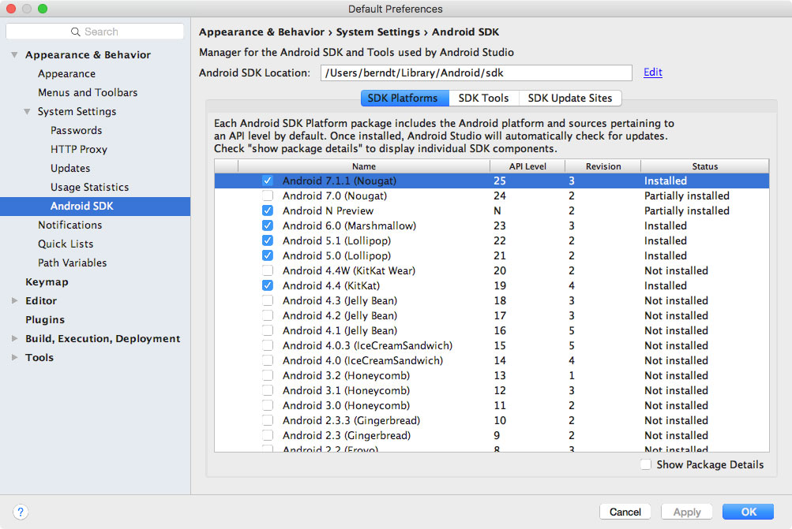

## Androidアプリのテスト環境のセットアップ
そろそろ, Androidアプリの構造と配布方法に関する基本的な知識があるはずである. 本章では,  セキュリティテスト環境のセットアップについて説明し, 使用するであろう簡単なテストプロセスを説明する. 本章は, 後の章でより詳細なテスト手法を説明するための基礎である.

Windows, Linux, Mac OSを実行しているほとんどすべてのマシンで十分に機能するテスト環境をセットアップすることができる.

#### ホストPCやMacで必要なソフトウェア
少なくとも, [Android Studio](https://developer.android.com/studio/index.html)(Android SDKに付属している)プラットフォームツール, エミュレータ, そして様々なSDKバージョンとフレームワークコンポーネントを管理するためのアプリが必要である. また, Android Studioはエミュレータイメージを生成するために, Android仮想端末(AVD)マネージャアプリケーションも付属している. 最新の[SDKツール](https://developer.android.com/studio/index.html#downloads)と[プラットフォームツール](https://developer.android.com/studio/releases/platform-tools.html)パッケージがシステムにインストールされていることを確認すること.

#### Android SDKのセットアップ
ローカルAndroid SDKインストールは, Android Studioを経由して管理される. 空のプロジェクトをAndroid Studioで生成し, "Tools->Android->SDK Manager"を選択してSDKマネージャGUIを開く. "SDK Platforms"タブは, 複数のAPIレベルのSDKをインストールする場所である. 最近のAPIレベルを以下に示す.

- API 23: Android 6.0
- API 24: Android 7.0
- API 25: Android 7.1
- API 26: Android 8.0



インストールされたSDKは以下のパスに存在する.

```
Windows:

C:\Users\<username>\AppData\Local\Android\sdk

MacOS:

/Users/<username>/Library/Android/sdk
```

注意: Linuxでは, SDKのディレクトリを選択する必要がある. 一般的には, `/opt`, `/srv`, `/usr/local`のいずれかが選択される.

#### 実機でのテスト
動的解析では, ターゲットアプリを実行するためにAndroidデバイスが必要である. 原理上は, Androidの実機がなくてもエミュレータ上でテストすることができる. しかしながら, エミュレータ上では非常にゆっくりとアプリは実行され, セキュリティテストが面倒になる可能性がある. 実機でテストすることは, よりスムーズな処理とより現実的な環境を生み出す.

実機でテストを行うためには, *Rooting* (すなわち, rootユーザとしてコマンドを実行するためにOSを改ざんすること)が推奨される. これによってオペレーティングシステムの完全な制御を手に入れ, アプリサンドボックスなどの制御を回避することができる. 同様に, これらの特権によってコードインジェクションや関数フックなどの技術をより簡単に使用できるようになる.

ルート化は危険な行為であり, ルート化を進める前には主に3つの因果関係を明確にする必要があることに注意すること. ルート化をすることで以下のような悪影響がある可能性がある.

- デバイスの保証が無効になる(何かしらの行為をする前に常にメーカーのポリシーをチェックすること)
- デバイスが文鎮化(bricking), すなわち動作不能かつ使用不能になる
- さらなるセキュリティリスクが引き起こされる(ルート化することで組み込みのエクスプロイト緩和がよく削除されるため)

個人情報を保存している個人端末をルート化すべきではない. 代わりに, 安い専用のテストデバイスを手に入れることを推奨する. GoogleのNexusシリーズなどの古いデバイスの多くは, 最新のAndroidバージョンを実行でき, テストに最適である.

**あなたのデバイスをルート化することは最終的にあなたの決断であり, どんな被害があったとしてもOWASPは一切の責任を負わないものとすることを理解する必要がある. 不明確な場合は, ルート化を始める前に専門家にアドバイスを求めること.**

###### どのモバイルがルート化可能か？
事実上, どのAndroidモバイルであってもルート化可能である. Android OSの商用バージョン(カーネルレベルでのLinux OSの進化である)は, モバイル世界に最適化されている. これらのバージョンでは, いくつかの機能は削除もしくは機能しないようになっている. 例えば, rootユーザ(昇格された特権を持つ)になるための特権階級でないユーザの機能. 電話をルート化することは, ユーザがrootユーザになることを許可することを意味する. 例えば, 別のユーザアカウントに変更するために使用される標準的なLinuxで実行可能な`su`と呼ばれるファイルを追加する.

モバイルデバイスをルート化するために, 初めにboot loaderをアンロックする. アンロックの方法はデバイスのメーカーによって異なる. しかしながら, 実用上の理由のため, モバイルデバイスをルート化することは, 他のものをルート化することよりも一般的である. とりわけセキュリティテストに関して言えば, Googleによって作成され, Samsung, LG, Motorolaによって製造されたデバイスは, 多くの開発者によって使用されているため, 特に最も一般的である. boot loaderがアンロックされた場合もそのデバイスの保証は無効にならず, またGoogleがroot化自体をサポートするための多くのツールを提供している. すべての主要なブランドのデバイスをルート化するためのガイドのキュレートされたリストは[XDAフォーラム](https://www.xda-developers.com/root/)に掲載されている.

#### ネットワークのセットアップ
利用可能なネットワーク設定オプションは最初に評価されなければならない. テストのために使用されるデバイスとインターセプトプロキシを実行するマシンは, 同一のWi-Fiネットワークで繋がっていなければならない. (既存の)アクセスポイントを使用するか, [アドホックワイヤレスネットワーク](https://support.portswigger.net/customer/portal/articles/1841150-Mobile%20Set-up_Ad-hoc%20network_OSX.html)を作成する.

ネットワークを設定し, テストマシンとモバイルデバイス間の接続が確立された時点で, いくつかの手順が残っている.

- [プロキシはインターセプトプロキシを指すように設定されなければならない](https://support.portswigger.net/customer/portal/articles/1841101-Mobile%20Set-up_Android%20Device.html)
- [インターセプトプロキシのCA証明書はAndroidデバイスの証明書の信頼された証明書に追加されなければならない. ](https://support.portswigger.net/customer/portal/articles/1841102-installing-burp-s-ca-certificate-in-an-android-device)CA証明書を保存するために使用するメニューの場所は, Androidバージョンや設定メニューのAndroid OEMの変更次第である.

これらの手順を完了してアプリを起動した後に, リクエストがインターセプトプロキシに表示されるだろう.

#### エミュレータでのテスト
エミュレータを使用する場合でも, ハードウェアテストデバイスを準備するための上述したすべての手順が適用される. エミュレータ環境でアプリをテストするために使用できるいくつかのツールとVMは, 動的テストに使用可能である.

- AppUse
- MobSF
- onConfigurationChanged

また, Android Studioを通してAVDを簡単に作成できる.

##### 仮想端末でのWebプロキシ設定
Android Studio 2.xに搭載されているAndroidエミュレータで動作する以下の手続きは, エミュレータにHTTPプロキシを設定するものである.

1. ローカルホストでリッスンするためにプロキシを設定する. エミュレータからホストへのプロキシポートをリバース/フォワードする. 例えば, 以下のように
```bash
$ adb reverse tcp:8080 tcp:8080
```
2. デバイスのアクセスポイント設定でHTTPプロキシを設定する:  
 - 設定メニューを開く
 - "ワイヤレス&ネットワーク"
 - "Wireless & Networks" -> "Cellular Networks" or "Wireless & Networks" -> "Mobile Networks"をタップする
 - "Access Point Names"を開く
 - "Proxy"フィールドに"127.0.0.1"を入力し, "Port"フィールドにプロキシのポート番号を入力する(例えば, "8080")
 - 右上のメニューを開き, "save"をタップする


今, HTTPとHTTPSのリクエストはホストマシンのプロキシ経由でルーティングされるはずだ. もしそうならないのであれば, 飛行機モードのon/offを切り替えてみてくれ.

##### 仮想端末でのCA証明書インストール
CA署名所をインストールする簡単な方法は, デバイスに証明書をプッシュし, セキュリティ設定を通して証明書ストアに追加することである. 例えば, PortSwigger(Burp) CA証明書は, 以下のようにインストールすることができる.

1. Burpを起動し, [http://burp/](http://burp/)に遷移するためにホスト上でWebブラウザを使用する. そして, "CA Certificate"をクリックすることで`cacert.der`をダウンロードする
2. ファイル拡張子を`.der`から`.cer`に変更する
3. エミュレータにファイルをプッシュする
```bash
$ adb push cacert.cer /sdcard/
```
4. "Settings" -> "Security" -> "Install from SD Card"に遷移する
5. 下にスクロールし, `cacert.cer`をタップする

その後, 証明書のインストールを承認するように促されるだろう(また, まだPINを設定していない場合は, デバイスにPINを設定するように求められるだろう).

##### rootとしてAndroid仮想端末(AVD)に接続する
[Android Studioを用いて利用可能な](https://developer.android.com/studio/run/managing-avds.html)AVDマネージャを用いて, Android仮想端末を作成することができる. また, Android SDKのtoolsディレクトリに存在する`Android`コマンドを用いてコマンドラインからAVDマネージャを起動することができる.

```bash
$ ./android avd
```

エミュレータが立ち上がり, 実行されると, `adb`コマンドを用いてルート接続を確立することができる.

```bash
$ adb root
$ adb shell
root@generic_x86:/ $ id
uid=0(root) gid=0(root) groups=0(root),1004(input),1007(log),1011(adb),1015(sdcard_rw),1028(sdcard_r),3001(net_bt_admin),3002(net_bt),3003(inet),3006(net_bw_stats) context=u:r:su:s0
```

したがって, ルート化されたエミュレータは必要ない. ルートアクセスは`adb`を用いて確立することができる.

##### エミュレータでテストする時の制約
エミュレータの使用にはいくつか欠点が存在する. アプリが特定のモバイルネットワークに頼っていたり, NFCやBluetoothを使用している場合, エミュレータでアプリを正しくテストできないかもしれない. また通常, エミュレータでのテストは普通より遅く, テストすること自体が問題を引き起こすかもしれない.

とは言っても, GPSやSMSなど多くのハードウェア特性をエミュレートすることができる.

### テスト方法
#### 手動による静的解析
Androidアプリセキュリティテストにおいて, ブラックボックステスト(コンパイルされたバイナリにはアクセスできるが, 元のソースコードにはアクセスできない)は, ホワイトボックステストとほとんど同じである. 大多数のアプリは, 簡単にデコンパイルすることができ, リバースエンジニアリングの知識があり, バイトコードやバイナリコードにアクセスできることは, リリースビルドが意図的に難読化されていない限りは, 元のコードを手に入れていることとほとんど同じである.

ソースコードテストでは, Android SDKとIDEを含むテスト環境を含めて, 開発者の設定と同じような設定が必要である. 物理デバイスやエミュレータ(アプリデバッグのため)のどちらかへのアクセスが推奨される.

**ブラックボックステスト** の期間中, ソースコードの元の形式にアクセスすることはできない. 通常, Androidデバイスにインストールでき, ソースコードの一部を復元することができる[Androidの.apk形式](https://en.wikipedia.org/wiki/Android_application_package)のアプリケーションパッケージが提供されているだろう.

以下の方法でデバイスからAPKをプルする.

```bash
$ adb shell pm list packages
(...)
package:com.awesomeproject
(...)
$ adb shell pm path com.awesomeproject
package:/data/app/com.awesomeproject-1/base.apk
$ adb pull /data/app/com.awesomeproject-1/base.apk
```

`aokx`は, コマンドラインを通してAPKのソースコードを復元する簡単な方法を提供する. また, `dex2jar`DFRをパッケージ化し, 抽出, 変換, デコンパイルの手順を自動化する. 以下のようにインストールを行う.

```
$ git clone https://github.com/b-mueller/apkx
$ cd apkx
$ sudo ./install.sh
```

これは, `apkx`を`/usr/local/bin`にコピーするべきである. 以下のようにテストしたいAPKで実行する.

```bash
$ apkx UnCrackable-Level1.apk
Extracting UnCrackable-Level1.apk to UnCrackable-Level1
Converting: classes.dex -> classes.jar (dex2jar)
dex2jar UnCrackable-Level1/classes.dex -> UnCrackable-Level1/classes.jar
Decompiling to UnCrackable-Level1/src (cfr)
```

アプリケーションがJavaのみに基づいており, ネイティブライブラリ(C/C++のコード)が存在しない場合, リバースエンジニアリングプロセスは比較的簡単で, リバースエンジニアリングプロセスによってほとんどすべてのソースコードが復元される. それでもコードが難読化されている場合は, 非常に悲観がかかり, 非生産的になる可能性がある. またこれは, ネイティブライブラリを含むアプリケーションにも当てはまる. まだリバースエンジニアリングされる可能性はあるが, プロセスは自動化されておらず, 低水準の詳細の知識が必要である.

Androidのリバースエンジニアリングに関するさらなる詳細は, "Androidの改ざんとリバースエンジニアリング"の章を参照のこと.

#### 自動化された静的解析
効率的な静的解析のためにはツールを使用すべきである. ツールを使用することで, テスターはより複雑なビジネスロジックに焦点を当てることができる. オープンソーススキャナから本格的なエンタープライズスキャナまで大量の静的コードアナライザが利用可能である. 作業とって最良のツールは, 予算, クライアント要件, テスターの好み次第である.

静的アナライザの中には, ソースコードの可用性を当てにするものが存在し, 他のものはインプットとしてコンパイルされたAPKを取り込む. 静的アナライザは, 潜在的問題に焦点を当てる手助けをしてくれるが, それ自身ですべての問題を見つけることができないかもしれないことに留意すること. 注意深く調査結果をレビューし, 脆弱性を検出する機会を増やすためにアプリが何を行っているかを理解しようとすること.

フォルスポジティブの可能性を減らすために適切に静的アナライザを設定する. おそらく, スキャンでいくつかの脆弱性カテゴリを選択するだけだろう. そうしないと, 静的アナライザによって出力された結果は圧倒的であり, 巨大な報告を手動で調査しなければならない場合, その努力は非生産的になるかもしれない.

APKの自動セキュリティ解析のいくつかのオープンソースのツールを以下に示す.
- [QARK](https://github.com/linkedin/qark/)
- [Androbugs](https://github.com/AndroBugs/AndroBugs_Framework)
- [JAADAS](https://github.com/flankerhqd/JAADAS)

エンタープライズツールに関しては, "テストツール"の章にある"静的ソースコード解析"のセクションを参照のこと.

#### 動的解析
静的解析とは異なり, アプリケーションの動的解析はモバイルアプリ実行中に行われる. テストケースはファイルシステムの調査や通信の監視など多岐にわたる.

いくつかのツールは, HTTP(S)プロトコルに依存しているアプリケーションの動的解析をサポートしている. 重要なツールのほとんどは, OWASP ZAPやBurp Suite Professionalが有名であるいわゆるインターセプトプロキシである. インターセプトプロキシは, テスターに中間者のポジションを与える. このポジションは, 認可, セッション, 管理などのテストに使用されるアプリのリクエスト及びエンドポイントのレスポンスすべての確認や改ざんに便利である.

##### Drozer
[Drozer](https://github.com/mwrlabs/drozer)は, 他のアプリケーションのIPCエンドポイントや下層のOSとやり取りするサードパーティアプリの役割を前提することによって, アプリとデバイスのセキュリティ脆弱性を検索できるAndroidセキュリティ評価フレームワークである. 以下のセクションでは, Drozerのインストールや使用のための必要な手順について記述する.

###### Drozerのインストール
**Linuxの場合**

ほとんどのLinuxディストリビューションで既にビルドされたパッケージは, [Drozer Webサイト](https://labs.mwrinfosecurity.com/tools/drozer/)で利用可能である. あなたが使用しているディストリビューションが記載されていない場合は, 以下のようにソースからDrozerをビルドすることができる.

```
git clone https://github.com/mwrlabs/drozer/
cd drozer
make apks
source ENVIRONMENT
python setup.py build
sudo env "PYTHONPATH=$PYTHONPATH:$(pwd)/src" python setup.py install
```

**Macの場合**

Macでは, 依存関係が存在しないことが原因でインストールはやや困難である. El Capitan以降のMac OSのバージョンにはOpenSSLがインストールされていないため, pyOpenSSLのコンパイルは動作しないだろう. [OpenSSLを自動でインストールする]ことで本問題を解決可能である. OpenSSLのインストールには以下を実行する.

```
$ brew install openssl
```

Drozerはいくつかのライブラリの旧バージョンに依存している. homebrewでPythonをインストールすること, もしくはvirtualenvで専用環境を構築することでシステムのPythonインストールを防ぐように. ([pyenv](https://github.com/pyenv/pyenv)のようなPythonバージョン管理ツールを使用することは一層良いが, それはこの本の範疇を超えている)

pipを通したvirtualenvのインストールには以下を実行する.

```
$ pip install virtualenv
```

作業用のプロジェクトディレクトリを作成して, そこにいくつかのファイルをダウンロードする. 続いて, 新たに作成したディレクトリに遷移し, `virtualenv drozer`コマンドを実行する. このコマンドによってPythonの実行ファイルとpipライブラリのコピーを含む"drozer"フォルダが生成される.

```
$ virtualenv drozer
$ source drozer/bin/activate
(drozer) $
```
今, OpenSSLの必要なバージョンをインストールし, 以前にインストールしたOpenSSLヘッダーに対してビルドする準備が完了した. pyOpenSSLバージョンのDrozerのソースにある誤字のせいでコンパイルが成功しないため, コンパイル前にソースを修正する必要がある. 幸いにも, ropnopは必要な手順を見つけ出し, [ブログ記事](https://blog.ropnop.com/installing-drozer-on-os-x-el-capitan/)として投稿している.

```
$ wget https://pypi.python.org/packages/source/p/pyOpenSSL/pyOpenSSL-0.13.tar.gz
$ tar xzvf pyOpenSSL-0.13.tar.gz
$ cd pyOpenSSL-0.13
$ sed -i '' 's/X509_REVOKED_dup/X509_REVOKED_dupe/' OpenSSL/crypto/crl.c
$ python setup.py build_ext -L/usr/local/opt/openssl/lib -I/usr/local/opt/openssl/include
$ python setup.py build
$ python setup.py install
```

これによって, 残りの依存関係をインストールすることができる.

```
$ easy_install protobuf==2.4.1 twisted==10.2.0
```

最後に, MWR LabsのWebサイトからPythonの.eggをダウンロードおよびインストールする.

```
$ wget https://github.com/mwrlabs/drozer/releases/download/2.3.4/drozer-2.3.4.tar.gz
$ tar xzf drozer-2.3.4.tar.gz
$ easy_install drozer-2.3.4-py2.7.egg
```

**エージェントのインストール**

Drozerエージェントは, デバイス自身で実行するソフトウェアコンポーネントである. [ここ](https://github.com/mwrlabs/drozer/releases/)から最新のDrozerエージェントをダウンロードし, adbを用いてインストールする.

```
$ adb install drozer.apk
```

**セッションの開始**

今, ホストマシンではDrozerコンソールがインストールされており, USB接続されたデバイスやエミュレータでエージェントが実行されているはずである. 今, 調査を始めるために２つを接続する必要がある.
実行中のエミュレータでDrozerアプリケーションを開き, 組み込まれたサーバを起動するためにアプリの下にあるOFFボタンをクリックする.  


このサーバはデフォルトで31415番ポートをリッスンする. このポートをローカルホストインタフェイスに転送するためにadbを使用し, その後, エージェントに接続するためにホストでDrozerを実行する.

```
$ adb forward tcp:31415 tcp:31415
$ drozer console connect
```

現在のセッションで実行されているすべてのDrozerモジュールを表示するには"list"コマンドを使用する.

**基本的なDrozerのコマンド**

- エミュレータにインストールされているすべてのパッケージをリストアップするためには, 以下のコマンドを実行する.
`dz> run app.package.list`
- 特定アプリのパッケージ名を検索するためには, "-f"と検索文字列を引き渡す.
`dz> run app.package.list -f (検索文字列)`
- パッケージに関する基本情報を確認するためには, 以下のコマンドを実行する.
`dz> run app.package.info -a (パッケージ名)`
- エクスポートされたアプリケーションコンポーネントを識別するためには, 以下のコマンドを実行する.
`dz> run app.package.attacksurface (パッケージ名)`
- ターゲットアプリケーションでエクスポートされたアクティビティのリストを識別するためには, 以下のコマンドを実行する.
`dz> run app.activity.info -a (パッケージ名)`
- エクスポートされたアクティビティを開始するためには, 以下のコマンドを実行する.
`dz> run app.activity.start --component (パッケージ名) (コンポーネント名)`
- ターゲットアプリケーションでエクスポートされたブロードキャストレシーバのリストを識別するためには, 以下のコマンドを実行する.
`dz> run app.Broadcast.info -a (パッケージ名)`
- ブロードキャストレシーバにメッセージを送信するためには, 以下のコマンドを実行する.
`dz> run app.Broadcast.send --action (ブロードキャストレシーバ名) -- extra (引数の数)`

**モジュールの使用**

難しい設定などは一切なしで, DrozerはAndroidプラットフォームの様々な側面といくつかのリモートエクスプロイトを調査するためのモジュールを提供する. 追加のモジュールをダウンロードおよびインストールすることによってDrozerの機能を拡張することができる.

**モジュールの検索**

公式のDrozerモジュールリポジトリは, GitHubのメインプロジェクトと並んでホストされている. これは自動的にDrozerのコピーに設定される. `module`コマンドでモジュールを検索することができる.

```
dz> module search tool
kernelerror.tools.misc.installcert
metall0id.tools.setup.nmap
mwrlabs.tools.setup.sqlite3
```

モジュールに関する詳細については, モジュールの説明を表示するために`-d`オプションを引き渡す.

```
dz> module  search url -d
mwrlabs.urls
    Finds URLs with the HTTP or HTTPS schemes by searching the strings
    inside APK files.

        You can, for instance, use this for finding API servers, C&C
    servers within malicious APKs and checking for presence of advertising
    networks.

```

**モジュールのインストール**

`module`コマンドでモジュールをインストールすることができる.

```
dz> module install mwrlabs.tools.setup.sqlite3
Processing mwrlabs.tools.setup.sqlite3... Already Installed.
Successfully installed 1 modules, 0 already installed
```

これによって, クエリに一致するあらゆるモジュールがインストールされる. 新たにインストールされたモジュールは, コンソールに動的にロードされ, すぐに利用可能になる.

**ネットワークのモニタリング/スニッフィング(監視/盗聴)**

[リアルタイムですべてのAndroidトラフィックをリモートで盗聴することは, tcpdump, netcat(nc), Wiresharkを利用することで可能である](http://blog.dornea.nu/2015/02/20/android-remote-sniffing-using-tcpdump-nc-and-wireshark/). 初めに, 携帯端末に[Android tcpdump](http://www.androidtcpdump.com/)の最新バージョンがインストールされていることを確認する. [インストールの手順](https://wladimir-tm4pda.github.io/porting/tcpdump.html)は以下の通りである.

```
# adb root
# adb remount
# adb push /wherever/you/put/tcpdump /system/xbin/tcpdump
```

`adb root`の実行で`adb cannot run as root in production builds`のエラーが返ってきた場合, 以下のようにtcpdumpをインストールすること.

```
# adb push /wherever/you/put/tcpdump /data/local/tmp/tcpdump
# adb shell
# su
$ mount -o rw,remount /system;
$ cp /data/local/tmp/tcpdump /system/xbin/
```

> 注意：tcpdumpを使用するためには, 携帯端末でroot権限が必要である.

動作するかどうかを確認するために, 一度`tcpdump`を実行する. いくつかのパケットが出現したら, CTRL+ｃを押すことでtcpdumpを止めることができる.

```
# tcpdump
tcpdump: verbose output suppressed, use -v or -vv for full protocol decode
listening on wlan0, link-type EN10MB (Ethernet), capture size 262144 bytes
04:54:06.590751 00:9e:1e:10:7f:69 (oui Unknown) > Broadcast, RRCP-0x23 reply
04:54:09.659658 00:9e:1e:10:7f:69 (oui Unknown) > Broadcast, RRCP-0x23 reply
04:54:10.579795 00:9e:1e:10:7f:69 (oui Unknown) > Broadcast, RRCP-0x23 reply
^C
3 packets captured
3 packets received by filter
0 packets dropped by kernel
```

Android携帯端末のネットワークトラフィックをリモートで盗聴するためには, 初めに`tcpdump`を実行し, 出力をnetcat(nc)にパイプする.

```
$ tcpdump -i wlan0 -s0 -w | nc -l -p 11111
```

上記のtcpdumpコマンドは, 以下を引き起こす.
- wlan0インタフェイスをリッスンする
- すべて(-s0)を取得するためにキャプチャのサイズ(スナップショットの長さ)をバイト単位で定義する
- ファイルへの書き込み. ファイル名の代わりに`-`を引き渡す.

パイプ(|)を使用することで, tcpdumpからnetcatにすべての出力を送る. 通常, wlan0インタフェイスを監視しなければならない.他のインタフェイスが必要な場合は, `$ ip addr`コマンドを用いて利用可能なオプションをリスト化する.

11111番ポートにアクセスするために, adbを通してポートを自身のマシンに転送する必要がある.

```
$ adb forward tcp:11111
```

以下のコマンドはnetcatを通して転送されたポートを接続し, Wiresharkにパイプする.

```
$ nc localhost 11111 | wireshark -k -s -i -
```

wiresharkは即座に起動するべきである(-k). 転送されたポートに接続しているnetcatを通してstdin(-i -)からすべてのデータを取得する. wlan0インタフェイスからの携帯端末のトラフィックのすべてを確認すべきである.


#### Firebase/Google Cloud Messaging (FCM/GCM)
Google Cloud Messaging(GCM)の光景であるFirebase Cloud Messaging(FCM)は, Googleによって提供されているアプリケーションサーバとクライアントアプリ間でメッセージを送信することができる無料のサービスである. サーバとクライアントアプリは, ダウンストリームメッセージとアップストリームメッセージを処理するFCM/GCMコネクションサーバを通して通信を行う.


ダウンストリームメッセージ(プッシュ通知)はアプリケーションサーバからクライアントアプリへ送信され, アップストリームメッセージはクライアントアプリからサーバへ送信される.

FCMはAndroid, iOS, Chromeで利用可能である. 今のところ, FCMは2つのコネクションサーバプロトコル(HTTPとXMPP)を提供している. [公式ドキュメント](https://firebase.google.com/docs/cloud-messaging/server#choose)に記載されている通り, これらのプロトコルは異なって実装されている. 以下の例では, 両プロトコルの傍受方法を示している.

#### 準備
FCMは, Googleのバックエンドと通信するためにXMPPもしくはHTTPを使用することができる.

**HTTP**

FCMはHTTP通信では, 5228, 5229, 5230番ポートを利用する. 通常, 5228番ポートのみ使用する.
- FCMによって使用されるポートのローカルポート転送を設定する. 以下の例は, Mac OS Xに適用される.
```bash
$ echo "
rdr pass inet proto tcp from any to any port 5228-> 127.0.0.1 port 8080
rdr pass inet proto tcp from any to any port 5229 -> 127.0.0.1 port 8080
rdr pass inet proto tcp from any to any port 5239 -> 127.0.0.1 port 8080
" | sudo pfctl -ef -
```

- インターセプトプロキシは, 上述したポート転送ルール(8080番ポート)で指定されたポートをリッスンしなければならない.

**XMPP**

XMPP通信では, [FCMは5235(プロダクション用), 5236(テスト用)番ポートを使用する](https://firebase.google.com/docs/cloud-messaging/xmpp-server-ref).
-  FCMによって使用されるポートのローカルポート転送を設定する. 以下の例は、 Mac OS Xに適用される.
```bash
$ echo "
rdr pass inet proto tcp from any to any port 5235-> 127.0.0.1 port 8080
rdr pass inet proto tcp from any to any port 5236 -> 127.0.0.1 port 8080
" | sudo pfctl -ef -
```
- インターセプトプロキシは, 上述したポート転送ルール(8080番ポート)で指定されたポートをリッスンしなければならない.

#### メッセージの傍受
ettercapを実行するためのさらなる準備と知識のために, "ネットワーク通信のテスト"の章と"中間者(MITM)攻撃"のテストケースを読むように.

テストデバイスとAndroidデバイスは, 同一のワイヤレスネットワークに接続されていなければならない. 以下のコマンドを用いてettercapを起動し, 以下のIPアドレスを自身のAndroidデバイスやワイヤレスネットワークのゲートウェイのIPアドレスに置き換える.
```
$ sudo ettercap -T -i en0 -M arp:remote /192.168.0.1// /192.168.0.105//
```

アプリを起動し, FCMを使用する機能をトリガーする. インターセプトプロキシでHTTPメッセージが表示されるはずである.


> ettercapを使用するときに, ProxyタブのOptions/Edit Interfaceの"Support invisible proxing"をアクティブにする必要がある.

デフォルトでは適切にデコードできないため, BurpやOWASP ZAPなどのインターセプトプロキシはこのトラフィックを表示しない. しかしながら, [Burp-non-HTTP-Extension](https://github.com/summitt/Burp-Non-HTTP-Extension)や[Mitm-relay](https://github.com/jrmdev/mitm_relay)などのXMPPトラフィックを可視化するBurpのプラグインが存在する.

#### 潜在的な障害
次のセキュリティ制御のためのデバッグビルドを提供する可能性をプロジェクトチームで議論しなさい. そしてそれは, まさにテストしようとしているアプリに実装されるかもしれない. デバッグビルドは, より広範囲の解析を可能とすることによって, (ホワイトボックス)テストにいくつかのメリットを提供する.

#### 証明書ピンニング
アプリが証明書ピンニングを実装した場合, インターセプトプロキシによって提供されるC.509証明書は拒否され, プロキシを通したどんなリクエストも許可しないだろう. 効率的なホワイトボックステストを実施するためには, 証明書ピンニングが無効化されているデバッグビルドを使用する.

ブラックボックステストで証明書ピンニングを回避するための方法がいくつか存在する. 例えば, [SSLUnpinning](https://github.com/ac-pm/SSLUnpinning_Xposed)や[Android-SSL-TrustKiller](https://github.com/iSECPartners/Android-SSL-TrustKiller)である. アプリがこれらのツールがカバーしているAPI機能を使用している場合に限り, 証明書ピンニングは数秒で回避することができる. アプリがこれらのツールがまだ対応していないフレームワークやライブラリを用いてSSLピンニングを実装している場合, SSLピンニングは手動でパッチを当てて無効化しなければならない. これは非常に時間がかかる.

手動でSSLピンニングを無効化する方法は2つ存在する.
- アプリ実行中に[Frida](https://www.frida.re/docs/android/)や[ADBI](https://github.com/crmulliner/adbi)を用いて動的にパッチを当てる.
- [smaliコードのSSLピンニングロジックを特定し, パッチを当て, APKを再構築する](https://serializethoughts.com/2016/08/18/bypassing-ssl-pinning-in-android-applications/).

SSLピンニングを無効化することは, 動的分析の必要条件を満たし、 その後アプリの通信を調査することができる.

詳細は,  "カスタム証明書ストアと証明書ピンニングのテスト"のテストケースを参照のこと.  

#### ルート検知
ルート検知は,  カスタムチェックや[RootBeer](https://github.com/scottyab/rootbeer)などの既に作成されたライブラリを用いて実装することができる. ルート検知方法の詳細なリストは, "Androidでのアンチリバーシング保護テスト"の章で説明している.

典型的なモバイルアプリセキュリティビルドでは, 通常, ルート検知が無効化されているデバッグビルドでテストしたいだろう. そのようなビルドがテストで使用できない場合, この本で後ほど説明する様々な方法でルート検知を無効化することができる.
