## Androidでの改ざんとリバースエンジニアリング
Androidの開放性は, リバースエンジニアリングにとって好都合な環境である. 次の章で, プロセスとして, AndroidリバーシングとOS固有のツールのいくつかの特性について注目していく.

Androidは, "他の"モバイルOSでは利用可能ではない大きな利点をリバースエンジニアリングにもたらす. Androidはオープンソースであるため, Android Open Source Project(AOSP)でソースコードを調査し, 思い通りにOSや標準ツールを改ざんすることができる. 標準の小売りデバイスでさえ, 苦労することなく開発者モードを有効にしたり, アプリを再度ロードするようなことが可能である. SDKを搭載した強力なツールから幅広く利用可能なリバースエンジニアリングツールまで, 生活によりゆとりを持たせるために慎重に行うべきことがたくさん存在する.

しかしながら, Android固有の課題もいくつか存在する. 例えば, Javaのバイトコートやネイティブコード両方を処理する必要がある. Javaネイティブインタフェイス(JNI)は, リバースエンジニアリングを行う人を混乱させるために, 時々意図的に使用される(公平のために言うと, パフォーマンスの向上やレガシーコードのサポートなど, JNIの使用には合理的な理由が存在する). 開発者はデータや機能を"隠す"ためにネイティブレイヤを時々使用し, 実行が頻繁に二つのレイヤの間を飛び越えるアプリを構築するかもしれない.  

最低, JavaベースのAndroid環境とAndroidに基づくLinux OSやカーネル両方の実用的な知識が必要である. また, Java仮想マシンで実行するネイティブコードとバイトコード両方に対応するための適切なツールセットも必要である.

ここで留意すべきは, 以下のセクションで様々なリバースエンジニアリング技術を実演するための例として, [OWASP Mobile Testing Guide Crackmes](https://github.com/OWASP/owasp-mstg/blob/master/Crackmes/)を使用するため, 一部かつ完全なネタバレを期待しておくように. 我々は, 読み進める前にあなた自身の挑戦で試しにやってみることを推奨する.

### 必要なもの
以下のものがシステムにインストールされていることを確認する.
- 最新のSDKツールとSDK Platform-toolsパッケージ. これらのパッケージは, Android Debugging Bridge(ADB)クライアントと、Androidプラットフォームとインタフェイスをとる他のツールを搭載している.
- Android NDK. これは, 異なるアーキテクチャのネイティブコードをクロスコンパイルするためのあらかじめビルドされたツールチェインを含むNative Development Kitのことである.

SDKとNDKに加えて, Javaバイトコードをより人間が読み取れるようにするための何かが必要である. 幸いにもほとんどの場合, JavaデコンパイラはAndroidバイトコードをうまく処理する. 人気のあるフリーのデコンパイラには, [JD](http://jd.benow.ca), [JAD](http://www.javadecompilers.com/jad), [Proycon](http://proycon.com/en/), [CFR](http://www.benf.org/other/cfr/)がある. 便宜上, [apkx wrapper script](https://github.com/b-mueller/apkx)に先述したデコンパイラのうちのいくつかをパックした. このスクリプトは, リリースのAPKファイルからJavaコードを抽出するプロセスを完全に自動化し, 異なるバックエンドで試すことを容易にする(以下の例の一部でも使用するだろう).

他のツールは好みや予算に関する問題である. 異なる長所と短所を持つ大量のフリーもしくは商用の逆アセンブラ, デコンパイラ, フレームワークが存在し, この本ではそれらのいくつかをカバーしている.  

#### Android SDKのセットアップ
ローカルのAndroid SDKのインストールは, Android Studioを通して管理する. Android Studioで空のプロジェクトを生成し, SDK Manager GUIを開くために"Tools->Android->SDK Manager"を選択する. "SDK Platforms"タブでは, 多様なAPIレベルのSDKをインストールすることができる.  最近のAPIレベルを以下に示す.

- API 21: Android 5.0
- API 22: Android 5.1
- API 23: Android 6.0
- API 24: Android 7.0
- API 25: Android 7.1
- API 26: Android O Developer Preview


インストールされたSDKは以下のパスに存在する.

```
Windows:

C:\Users\<username>\AppData\Local\Android\sdk

MacOS:

/Users/<username>/Library/Android/sdk
```

注意: Linuxでは, SDKのディレクトリを選択する必要がある. 一般的には, `/opt`, `/srv`, `/usr/local`のいずれかが選択される.

#### Android NDKのセットアップ
Android NDKは, ネイティブコンパイラとツールチェインのあらかじめビルドされたバージョンを含んでいる. GCCとClang両方のコンパイラは, 伝統的にサポートされているが, GCCのアクティブサポートはNDKのバージョン14で終了した. デバイスアーキテクチャとホストOSは, 適切なバージョンを決定する. あらかじめビルドされたツールチェインは, NDKの`toolchains`ディレクトリにあり, そこは各アーキテクチャのサブディレクトリを1つ含んでいる.

| アーキテクチャ | ツールチェイン名 |
|-------------- | ---------------|
|ARM-based|arm-linux-androideabi-&lt;gcc-version&gt;|
|x86-based|x86-&lt;gcc-version&gt;|
|MIPS-based|mipsel-linux-android-&lt;gcc-version&gt;|
|ARM64-based|aarch64-linux-android-&lt;gcc-version&gt;|
|X86-64-based|x86_64-&lt;gcc-version&gt;|
|MIPS64-based|mips64el-linux-android-&lt;gcc-version&gt;|

正しいアーキテクチャを選択する傍ら, ターゲットとしたいネイティブAPIレベルに的確なsysrootを指定する必要がある. sysrootは, ターゲットに関するシステムヘッダとライブラリを含むディレクトリである. ネイティブAPIは, AndroidのAPIレベルによって変わってくる. 各APIレベルに対して考えられるsysrootは, `$NDK/platforms/`に存在する. 各APIレベルのディレクトリは, 様々なCPUやアーキテクチャのサブディレクトリを含んでいる.

ビルドシステムをセットアップする1つの可能性は, 環境変数としてコンパイラのパスと必要なフラグをエクスポートすることである. しかしながら, 状況をより簡単にするために, NDKによっていわゆるスタンドアロンのツールチェイン、すなわち必要とされる設定を組み込んだ「一時的な」ツールチェインを生成することができる.

スタンドアロンのツールチェインを設定するために, [NDKの最新の安定バージョン](https://developer.android.com/ndk/downloads/index.hml#stable-downloads)をダウンロードする必要がある. ZIPファイルを抽出し, NDKのルートディレクトリに遷移し, 以下のコマンドを実行する.

```bash
$ ./build/tools/make_standalone_toolchain.py --arch arm --api 24 --install-dir /tmp/android-7-toolchain
```

上記コマンドは, `/tmp/android-7-toolchain`ディレクトリにAndroid 7.0用のスタンドアロンのツールチェインを生成する. 便宜上, ツールチェインのディレクトリを指し示す環境変数をエクスポートすることができる(例ではこれを使用する). 以下のコマンドを実行するか, `.bash_profile`や他のスタートアップスクリプトに追加する.

```bash
$  export TOOLCHAIN=/tmp/android-7-toolchain
```

### 開発者モードの有効化
ADBデバッグインタフェイスを利用するために, デバイスでUSBデバッグを有効にする必要がある. Android 4.2以降, 設定アプリの「開発者オプション」のサブメニューはデフォルトで非表示となっている. これを表示するためには, "About phone(端末情報)"の"Build number(ビルド番号)"セクションを7回タップする. ビルド番号フィールドの位置はデバイスによって若干異なることに注意する必要がある(例えば, LGの端末では"About phone -> Software information"の下にある). この操作が完了すると, 設定メニューの下部に"Developer options(開発者オプション)"が表示される. 開発者オプションが有効になると, "USB debugging(USBデバッグ)"スイッチでデバッグを有効にすることができる.  

USBデバッグが有効になると, 以下のコマンドを用いて接続されたデバイスを表示することができる.

```bash
$ adb devices
List of devices attached
BAZ5ORFARKOZYDFA	device
```

### フリーのリバースエンジニアリング環境の構築
少ない努力で, リーズナブルなGUIベースのリバースエンジニアリング環境をフリーで構築することができる.

デコンパイルされたソースを検索するために, [IntelliJ](https://www.jetbrains.com/idea/)を推奨する. これは, コードのブラウジングに優れた比較的軽量なIDEであり, 基本的なコンパイルされたアプリのオンデバイスデバッグを可能にする. しかしながら, 魅力がなく, 動作が重く, 複雑なものを好むのであれば, Eclipseがぴったりだろう(著者の個人的偏見に基づいている).

Javaの代わりにSmaliを見ることが問題なければ, [Intellijのsmalideaプラグイン](https://github.com/JesusFreke/smali/wiki/smalidea)を使用することができる. Smalideaは, バイトコードと識別子の改名を通してシングルステップをサポートし, 命名されていないレジスタを監視するため, JDとIntelliJの設定の組み合わせよりもより一層強力である.

[APKTool](https://ibotpeaches.github.io/Apktool/)は, APKアーカイブから直接リソースを抽出し, 逆アセンブルすることができ, JavaバイトコードをSmali形式に逆アセンブルすることができる評判の良いフリーツールである(Smali/Baksmaliは, Dex形式のアセンブラ/逆アセンブラである. また, Smali/Baksmaliは"アセンブラ/逆アセンブラ"のアイスランド語でもある). APKToolを使用することで, パッケージを逆アセンブルすることができる. これはManifestにパッチを当て, 変更を適用するのに便利である.

 [Radare2](https://www.radare.org/)や[Angr](http://angr.io/)などのオープンソースのリバースエンジニアリングフレームワークを用いて, より複雑なタスク(プログラム解析や自動化された難読化の解除)を成し遂げることができる. 本ガイドを通して, これらのフリーツールやフレームワークの多くの使用例を見つけることができる.

#### 商用ツール
完全無料のセットアップが可能とはいえ, 商用ツールへの投資を考えるべきである. これらのツールの主な利点は, 利便性である. たとえば, 良いGUI, 多くの自動化, エンドユーザサポートを備えている. リバースエンジニアリングで生計を立てる場合, それらを用いることで多くの時間を節約できるだろう.

##### JEB
商用のデコンパイラである[JEB](https://www.pnfsoftware.com/)には, Androidアプリの静的解析および動的解析のために必要な機能すべてを一体化パッケージに含んでいる. JEBそこそこ信頼でき, かつ迅速なサポートが含まれている. また, 組み込みのデバッガを持っており, 効率の良い作業を可能にする. たとえば, デコンパイルされた(なおかつ注釈付きの)ソースに直接ブレークポイントを設定することは, 特にProGuardで難読化されたバイトコードの場合はすこぶる有益である. もちろん, このような利便性を得るのにお金がかからないわけがないし, 今やJEBはサブスクリプションベースのライセンスを通して提供されるため, 使用するためには毎月使用料を支払う必要がある.

##### IDA Pro
[IDA Pro](https://www.hex-rays.com/products/ida/)は, ARM, MIPS, Javaバイトコード, もちろんIntel ELFバイナリと互換性がある. また, Javaアプリケーションとネイティブプロセス両方のデバッガを搭載している. 強力なスクリプト, 逆アセンブリ, 拡張機能を備えたIDA Proは, ネイティブプログラムとライブラリの静的解析に最適である. しかしながら, Javaコードのために提供されている静的解析機能は, かなり基本的なものである. 例えば, 逆アセンブリされたSmaliを得ることはできるが, あまり多くはない. パッケージやクラスストラクチャを検索することはできず, 実行できないアクション(クラスの改名など)も存在する, そしてそれは, より複雑なJavaアプリを扱う作業を退屈にする可能性がある.

### リバースエンジニアリング
リバースエンジニアリングは, どのように動作しているのかを解明するためにアプリを分析するプロセスである. コンパイルされたアプリの検査(静的解析), 実行中のアプリの監視(動的解析), または両方を組み合わせることによって行うことができる.

#### Javaコードの静的解析
いくつかの厄介な, ツールを破壊する耐デコンパイル技術が適用されていない限り, Javaバイトコードは多くの問題なく, ソースコードに戻すことができる. 以下の例で, Androidレベル1のUnCrackableアプリを使用するので, ダウンロードしていない場合はダウンロードすること. まず初めに, デバイスやエミュレータにアプリをインストールし, crackmeが何であるかを確認するためにアプリを実行する.

```
$ wget https://github.com/OWASP/owasp-mstg/raw/master/Crackmes/Android/Level_01/UnCrackable-Level1.apk
$ adb install UnCrackable-Level1.apk
```


何らかのシークレットコードが見つけることを期待しているように思える.

我々は, アプリ内のどこかに格納された秘密の文字列を探しているので, 次のステップは中を見ることである. 初めに, APKファイルをunzipし, コンテンツを確認する.

```
$ unzip UnCrackable-Level1.apk -d UnCrackable-Level1
Archive:  UnCrackable-Level1.apk
  inflating: UnCrackable-Level1/AndroidManifest.xml  
  inflating: UnCrackable-Level1/res/layout/activity_main.xml  
  inflating: UnCrackable-Level1/res/menu/menu_main.xml  
 extracting: UnCrackable-Level1/res/mipmap-hdpi-v4/ic_launcher.png  
 extracting: UnCrackable-Level1/res/mipmap-mdpi-v4/ic_launcher.png  
 extracting: UnCrackable-Level1/res/mipmap-xhdpi-v4/ic_launcher.png  
 extracting: UnCrackable-Level1/res/mipmap-xxhdpi-v4/ic_launcher.png  
 extracting: UnCrackable-Level1/res/mipmap-xxxhdpi-v4/ic_launcher.png  
 extracting: UnCrackable-Level1/resources.arsc  
  inflating: UnCrackable-Level1/classes.dex  
  inflating: UnCrackable-Level1/META-INF/MANIFEST.MF  
  inflating: UnCrackable-Level1/META-INF/CERT.SF  
  inflating: UnCrackable-Level1/META-INF/CERT.RSA  

```

標準の設定では, Javaバイトコードとアプリデータのすべてはアプリルートディレクトリの`class.dex`ファイルにある. ファイルは, JavaプログラムをパックするAndroid特有の方法であるDalvik実行形式(DEX)に一致する. ほとんどのJavaデコンパイラは, 入力としてrplain classやJARを受け取るので, 初めにclass.dexファイルをJARに変換する必要がある. `dex2jar`や`enjarify`を使用することでこれを行うことができる.

JARファイルが手に入ると, 任意のフリーのデコンパイラを使用してJavaコードを生成することができる. この例では, CFRデコンパイラを使用している. CFRは活発に開発されており, 最新のリリースは著者のWebサイトで入手可能である. CFRはMITライセンスの下でリリースされたため, ソースコードは入手できないが, 自由に使用することができる.

CFRを実行するもっとも簡単な方法は, `dex2jar`をパッケージ化し, 抽出, 変換, デコンパイルを自動化している`apkx`を通すことである. インストールは以下を参照のこと.

```
$ git clone https://github.com/b-mueller/apkx
$ cd apkx
$ sudo ./install.sh
```

これは, `apkx`を`/usr/local/bin`にコピーしなければならない. `UnCrackable-Level1.apk`で実行する必要がある.

```bash
$ apkx UnCrackable-Level1.apk
Extracting UnCrackable-Level1.apk to UnCrackable-Level1
Converting: classes.dex -> classes.jar (dex2jar)
dex2jar UnCrackable-Level1/classes.dex -> UnCrackable-Level1/classes.jar
Decompiling to UnCrackable-Level1/src (cfr)
```

 今, `Uncrackable-Level1/src`ディレクトリでデコンパイルされたソースを発見できるだろう. ソースを見るために, シンプルなテキストエディタ(出来れば構文をハイライトしてくれるもの)が良いが, Java IDE内にコードをロードすることはナビゲーションをより簡単にする. デバイス上でのデバッグ機能を提供するIntelliJにコードをインポートしてみよう.

 IntelliJを開き, "New Project"ダイアログの左側のタブのプロジェクトタイプで"Android"を選択する. アプリケーション名に"Uncrackable1"を, 会社名に"vantagepoint.sg"を入力する. これは, もとのパッケージ名と一致する"sg.vantagepoint.uncrackable1"の結果となる. Intellijは正しいプロセスを識別するのにパッケージ名を使用するので, 後で実行中のアプリにデバッガを配置したい場合, 一致するパッケージ名を使用することは重要である.

 

次のダイアログで, 任意のAPI番号を選択する. なお, 実際はそのプロジェクトをコンパイルしたくないので, 番号はどうでもよい. "next"をクリックし, "Add no Activity"を選択した後, "finish"をクリックする.

プロジェクトを作成すると, 左側にある"1: Project"を展開して, `app/src/main/java`フォルダに遷移する. IntelliJによって作成されたデフォルトのパッケージ"sg.vantagepoint.uncrackable1"を右クリックして削除する.


今, `Uncrackable-Level1/src`ディレクトリをファイルブラウザで開き, IntelliJプロジェクトビューの空の`Java`フォルダに`sg`ディレクトリをドラッグする(移動する代わりにフォルダをコピーするには, "alt"キーをホールドする).


結果的に, アプリが構築された元のAndroid Studioプロジェクトに似た構造になるだろう,


IntelliJがコードをインデックスするとすぐに, まるで他のJavaプロジェクトを見ているかのようにそれを見ることができる. ここで留意すべきは, デコンパイルされたパッケージ, クラス, メソッドのほとんどは, 1文字の変わった名前が付けられていることである. これは, ビルド時にProGuardによってバイトコードが"縮小"されたためである. これは, バイトコードを少し読みにくくする難読化の基本的なタイプであるが, このような極めて単純なアプリでは, 大した頭痛の原因とはならない. しかしながら, より複雑なアプリを解析する場合は, 非常に迷惑となる可能性がある.

難読化されたコードを解析する場合, 付随するようにクラス名, メソッド名, その他の識別子に注釈をつけることが, グッドプラクティスである. `sg.vantagepoint.a`パッケージの`MainActivity`クラスを開く. "verify"ボタンをタップすると`verify`メソッドが呼び出される. このメソッドは, boolean(ブール値)を返す`a.a`と呼ばれる静的メソッドにユーザインプットを引き渡す. `a.a`がユーザインプットを検証することはもっともらしいので, これを反映するためにコードをリファクタリングする.


クラス名(`a.a`の初めの`a`)を右クリックし, ドロップダウンメニューから(もしくはShift-F6を押して)Refactor->Renameを選択する. 今までのクラスに関して知っていることを与えられた, より意味のあるものにクラス名を変更する. たとえば, "Validator"と名付けることができる(いつでも後で名前を変更可能). 今, `a.a`は`Validator.a`になった. 静的メソッドを`a`から`check_input`に改名するために, 同じ手続きに従う.


Congratulations! たった今, 静的解析の基本を学習した. 解析されたプログラムに関する理論を理論化, 注釈付け, 少しずつ修正することは, 完全に理解するまで, もしくは少なくとも達成したいと思っていることは何でも十分に理解するまでである.

次に, `check_input`メソッドでCtrl+(Macの場合はCommand+)をクリックする. これはメソッド定義に連れていく. デコンパイルされたメソッドは以下のように見える.

```java
    public static boolean check_input(String string) {
        byte[] arrby = Base64.decode((String)"5UJiFctbmgbDoLXmpL12mkno8HT4Lv8dlat8FxR2GOc=", (int)0);
        byte[] arrby2 = new byte[]{};
        try {
            arrby = sg.vantagepoint.a.a.a(Validator.b("8d127684cbc37c17616d806cf50473cc"), arrby);
            arrby2 = arrby;
        }sa
        catch (Exception exception) {
            Log.d((String)"CodeCheck", (String)("AES error:" + exception.getMessage()));
        }
        if (string.equals(new String(arrby2))) {
            return true;
        }
        return false;
    }
```

従って, 16進エンコードされた暗号鍵(16 HEXバイト = 126bitで一般的な鍵長)のように見えるなにかと一緒に`sg.vantagepoint.a.a`(再び, すべて`a`と名付けられている)パッケージの`a`関数に引き渡されるBase64でエンコードされた文字列がある. 厳密に何がこの特定のすべきことをするのだろうか？調査するためにCtrlをクリックする.


```java
public class a {
    public static byte[] a(byte[] object, byte[] arrby) {
        object = new SecretKeySpec((byte[])object, "AES/ECB/PKCS7Padding");
        Cipher cipher = Cipher.getInstance("AES");
        cipher.init(2, (Key)object);
        return cipher.doFinal(arrby);
    }
}
```

今, 良い線を行っている. 単に標準のAES-ECBである. `check_input`の`arrby1`に格納されているBase64の文字列は暗号文であるように見える. それは128bitのAESで復号され, ユーザインプットと比較される. おまけのタスクとして, 抽出された暗号文を解読し, 秘密の値を見つけてみよう.

解読された文字列を入手するより早い方法は, 動的解析を加えることである. 方法を示すためにUnCrackable Level 1を後で再訪するので, まだプロジェクトを消さないように！

 #### ネイティブコードの静的解析
 DalvicとARTのどちらも, JavaコードがC/C++で書かれたネイティブコードとやり取りする方法を定義するJava Native Interface(JNI)をサポートしている. 他のLinuxベースのオペレーティングシステム同様に, ネイティブコードはELF動的ライブラリ("\*.so")の中にパッケージ化されている. これは, Androidアプリが`System.load`メソッドを通して実行時にロードする.

Android JNI機能は, Linux ELFライブラリにコンパイルされたネイティブコードで記述されている. それは標準的なLinuxフェアである. しかしながら, 幅広く使用されているCライブラリ(glibcなど)に頼る代わりに, Androidバイナリは, [Bionic](https://github.com/android/platform_bionic)と呼ばれるカスタムlibcに対してビルドされている. Bionicは, システムプロパティとロギングのような重要なAndroid特有のサービスのためのサポートを追加しており, それは完全にPOSIX互換というわけではない.

OWASP MSTGリポジトリからHelloWorld-JNI.apkをダウンロードすること. エミュレータやAndroidデバイスにインストールして実行するかは任意である.

```
$ wget HelloWorld-JNI.apk
$ adb install HelloWorld-JNI.apk
```

このアプリは必ずしも超大作というわけではない. "Hello from C++"というテキストのラベルを表示するだけである. これは, C/C++で新たなプロジェクトを作成したときにAndroidがデフォルトで生成するアプリである...が, JNI呼び出しの基本原理を示すには十分である.


`apkx`でAPKをデコンパイルする. これは, `HelloWorld/src`ディレクトリの中にソースコードを抽出する.

```bash
$ wget https://github.com/OWASP/owasp-mstg/blob/master/OMTG-Files/03_Examples/01_Android/01_HelloWorld-JNI/HelloWord-JNI.apk
$ apkx HelloWord-JNI.apk
Extracting HelloWord-JNI.apk to HelloWord-JNI
Converting: classes.dex -> classes.jar (dex2jar)
dex2jar HelloWord-JNI/classes.dex -> HelloWord-JNI/classes.jar
```

MainActivityは, `MainActivity.java`ファイルに含まれている. "Hello World"テキストビューは`onCreate()`メソッドに存在している.


```java
public class MainActivity
extends AppCompatActivity {
    static {
        System.loadLibrary("native-lib");
    }

    @Override
    protected void onCreate(Bundle bundle) {
        super.onCreate(bundle);
        this.setContentView(2130968603);
        ((TextView)this.findViewById(2131427422)).setText((CharSequence)this.stringFromJNI());
    }

    public native String stringFromJNI();
}

}
```

上記例の一番下にある`public native String stringFromJNI`の宣言に注意すること. "native"というキーワードは, メソッドがネイティブ言語で実装されていることをJavaデコンパイラに示している. 対応する関数は実行中に解決されるが, 期待されているシグネチャでグローバルシンボルをエクスポートするネイティブライブラリがロードされた場合に限る(シグネチャは, パッケージ名, クラス名, メソッド名を含む). この例では, この要件は以下に示すC/C++の関数で満たされる.

```c
JNIEXPORT jstring JNICALL Java_sg_vantagepoint_helloworld_MainActivity_stringFromJNI(JNIEnv *env, jobject)
```

ところで, この関数のネイティブ実装はどこにあるのだろうか？APKアーカイブの`lib`ディレクトリの中を確認すると, 異なるプロセッサアーキテクチャにちなんで名付けられた8つのサブディレクトリが目に入るだろう. これらのディレクトリのそれぞれは, 問題となっているプロセッサアーキテクチャのためにコンパイルされた`libnative-lib.so`と呼ばれるネイティブライブラリのバージョンを含んでいる. `System.loadLibrary`が呼び出されたとき, ローダーはアプリが実行しているデバイスに基づいて正確なバージョンを選択する.


上記の命名規則に従い, ライブラリに`Java_sg_vantagepoint_helloworld_MainActivity_stringFromJNI`と呼ばれるシンボルをエクスポートすることを期待することができる. Linuxシステムでは, `readelf`(GNU binutilsに含まれている)や`nm`を用いてシンボルのリストを取得することができる. Mac OS上では, MacportsやHomebrewを通してインストールすることができる`gradelf`ツールを用いてこれを行う. 以下の例では, `gradelf`を使用している.

```
$ greadelf -W -s libnative-lib.so | grep Java
     3: 00004e49   112 FUNC    GLOBAL DEFAULT   11 Java_sg_vantagepoint_helloworld_MainActivity_stringFromJNI
```

これは, `stringFromJNI`ネイティブメソッドが呼び出されたときに最終的に実行されるネイティブ関数である.

コードを逆アセンブルするために, ELFバイナリ(つまり, 任意の逆アセンブラ)を理解する任意の逆アセンブラに`libnative-lib.so`をロードすることができる. 異なるアーキテクチャのバイナリがアプリに付属している場合, 逆アセンブラと互換性がある限りは, 理論上は, 自身が最も慣れ親しんでいるアーキテクチャを選定することができる. 各バージョンは, 同じソースからコンパイルされ, 同じ関数を実装する. しかしながら, 後でライブデバイスでライブラリをデバッグする計画があるのであれば, 通常は ARM ビルドを選定するのが賢明である. 

新旧両方の ARM プロセッサをサポートするために, Androidアプリは, 異なるアプリケーションバイナリインタフェイス(ABI)のバージョンでコンパイルされた複数の ARM ビルドとして同梱される. ABIは, 実行時にアプリケーションのマシンコードがシステムとどのようにやり取りするかを定義する. 以下のABIがサポートされている. 

- armeabi: ABIは, 最低でもARMv5TEの命令セットをサポートするARMベースのCPU
- armeabi-v7a: このABIは数個のCPU命令セット拡張を含むようにarmeabiを拡張する
- arm64-v8a: 新しい64bit ARMアーキテクチャであるAArch64をサポートするARMv8ベースのCPUのためのABI

逆アセンブラのほとんどは, これらのアーキテクチャのいずれかを処理することができる. 以下に, IDA Proでの`armeabi-v7a`バージョンを示している. これは, `lib/armeabi-v7a/libnative-lib.so`に存在している. IDA Proのライセンスを所有していない場合, Hex-RaysのWebサイトで利用できるデモ版や評価版を用いて同じことをすることができる. 

IDA Proのファイルを開く. "Load new file"ダイアログで, ファイルタイプとして"ELF for ARM (Shared Object)"を選択する(IDAは自動的にこれを検知するだろう). また, プロセッサタイプとして"ARM Little-Endian"を選択する. 


ファイルを開き次第, 左にある"Functions"ウインドウをクリックし, 検索ダイアログを開くために`Alt+t`を押す. "java"を入力し, エンターを押す. これによって`Java_sg_vantagepoint_helloworld_MainActivity_stringFromJNI`関数は強調されるだろう. 逆アセンブリウインドウでそのアドレスにジャンプするために関数をダブルクリックする. 今, "Ida View-A"は関数の逆アセンブリを表示しているだろう. 

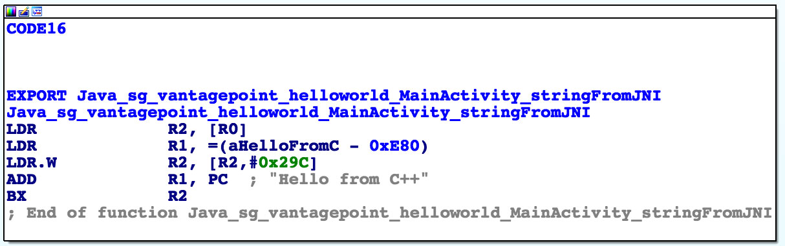

コードは多くないが、解析すべきである. 最初に知っておくことは, 全てのJNIに渡される第一引数がJNIインタフェイスポインタであることである. インタフェイスポインタは, ポインタへのポインタである. ポインタは関数テーブル－さらにいっそう多くのポインタの配列－を指し示す. 各ポインタはJNIインタフェイス関数を指し示す(頭はまだ回転していますか？)この関数テーブルは, Java VMによって初期化され, ネイティブ関数にJava環境とやり取りすることを許可する. 


その点を考慮して, アセンブリコードの各行を見てみよう. 

```
LDR  R2, [R0]
```

注意：第一変数(R0内)はJNI関数テーブルポインタへのポインタである. `LDR`命令は, この関数テーブルポインタをR2にロードする, 

```
LDR  R1, =aHelloFromC
```

この命令は, 文字列"Hello from C++."のPC相対オフセットをR1ロードする. この文字列はオフセット 0xe84の関数ブロックの直後に来ることに注意すること. プログラムカウンタと比較してアドレス指定は, コードがメモリの位置とは無関係に実行することを許可する. 

```
LDR.W  R2, [R2, #0x29C]
```

この命令は, R2によって指し示されたJNI関数ポインタテーブルに関数ポインタをオフセット0x29Cからロードする. これは`NewStringUTF`関数である. Android NDKに含まれるjni.hの関数ポインタのリストを見ることができる. 関数プロトタイプは以下のように見える. 

```
jstring     (*NewStringUTF)(JNIEnv*, const char*);
```

この関数は2つの引数(JNIEnvポインタ(すでにR0に存在する)とStringポインタ)を必要とする. 次に, PCの現在の値がR1に追加され, 結果として, 静的文字列 "Hello from C++"(PC + オフセット) の絶対アドレスになる. 

```
ADD  R1, PC
```

最終的に, プログラムはR2内にロードされた`NewStringUTF`関数ポインタへの分岐命令を実行する. 

```
BX   R2
```

この関数がリターンするとき, R0は新たに構成されたUTF文字列へのポインタを格納している. これは最終的な返り値であるため、R0は変更されないまま関数はリターンする. 

#### デバッグとトレース

ここまでは, ターゲットのアプリを実行せずに, 静的解析技術を使用してきた. 現実世界では特に, マルウェアやより複雑なピュアアプリをリバーシングする場合は, 静的解析は非常に困難である. 実行時にアプリを観察して操作することで, アプリのふるまいを非常に容易に解読することができる. 次に, アプリのふるまい解析に役立つ動的解析手法について考えていく. 

Androidアプリは, 2つの異なる種類のデバッグ(Java Debug Wire Protocol(JDWP）を用いたJavaランタイムのレベル上でのデバッグ, ネイティブレイヤ上でのLinux/Unixスタイルのptraceベースのデバッグ)をサポートしている. どちらもリバースエンジニアの役に立つ. 

##### リリースアプリのデバッグ

DalvikとARTは, デバッガとデバッグをするJava仮想マシン(VM)間の通信のためのプロトコルであるJDWPをサポートする. JDWPは, 全てのコマンドラインツールやJDB, JEB, IntelliJ, Eclipseを含むJava IDEによってサポートされている標準デバッグプロトコルである. AndroidのJDWPの実装は, Dalvik Debug Monitor Server(DDMS)によって実装された追加機能をサポートするためのフックも含まれている. 

JDWPデバッガを使用することで, Javaコードをステップ実行, Javaメソッドでのブレイクポイントの設定, ローカル変数やインスタンス変数の調査/改ざんができるようになる. "通常の" Androidアプリ(例えば, ネイティブライブラリをあまり呼び出さない)をデバッグする大抵の場合, JDWPデバッガを使用するだろう

以下のセクションで, JDBのみを用いてUnCrackable App for Android Level 1の解決方法を説明しよう. これは, crackmeを解決するための *効率的な* 方法ではないことに注意すること. 本ガイドで後ほど紹介するFridaやほかの方法を用いてずっと早く行うことができる. しかしながら, これはJavaデバッガ機能の入門として役に立つ. 

###### リパック

全てのデバッグ可能なプロセスはJDWPプロトコルパケットを処理するために追加のスレッドを実行する. このスレッドは, マニフェストファイルの`&lt;application&gt;`要素に`android:debuggable="true"`タグがセットされているアプリのためだけに開始される. これは, エンドユーザに届けられるAndroidデバイスの一般的な構成である. 

アプリをリバースエンジニアリングする場合, ターゲットアプリのリリースビルドにのみアクセスするだろう. リリースビルドはデバッグされることを意図していない. 結局のところ, それは*デバッグビルド*の目的である, 
システムプロパティの`ro.debuggable`が"0"に設定されている場合, AndroidはJDWPとリリースビルドのネイティブデバッグ両方を許可しない. 回避するのは簡単ではあるが, 行ブレイクポイントの欠如などの制限に直面するだろう. それでもなお, 不完全なデバッガでさえ, 非常に貴重なツールである. プログラムの実行状態を調査することが可能であれば, プログラムを理解することが *非常に* 簡単になる. 

リリースビルドをデバッグ可能ビルドに"変換"することは, アプリのマニフェストファイルにあるフラグを改ざんする必要がある. この改ざんはコードの署名が破壊されるため, 改ざんされたAPKアーカイブに再署名する必要もある. 

再署名するためには, 第一にコード署名証明書が必要である. 後ほどAndroid Studioでビルドする場合は, IDEがすでに生成されたデバッグkeystoreと証明書を`$HOME/.android/debug.keystore`に所持している. このkeystoreのデフォルトパスワードは"Android"で, keyは"androiddebugkey"と呼ばれている. 

標準のJavaディストリビューションはkeystoreと証明書を管理するための`keytool`を含んでいる. 自身の署名証明書と鍵を生成し, そしてデバッグkeystoreに追加することができる：

```
$ keytool -genkey -v -keystore ~/.android/debug.keystore -alias signkey -keyalg RSA -keysize 2048 -validity 20000
```

証明書が利用可能になった後, 以下の手順に従ってUnCrackable-Level1.apkをリパックすることができる. Android Studioのビルドツールディレクトリがパス内になければならないことに注意すること. そのディレクトリは, `[SDK-Path]/build-tools/[version]`に位置している. `zipalign` と `apksigner`ツールはこのディレクトリに存在する. 

1. `apktool`を用いてアプリを展開し, AndroidManifest.xmlをデコードする. 

```bash
$ apktool d --no-src UnCrackable-Level1.apk
```

2. テキストエディタを用いてマニフェストにandroid:debuggable = "true"を追加する. 

```xml
<application android:allowBackup="true" android:debuggable="true" android:icon="@drawable/ic_launcher" android:label="@string/app_name" android:name="com.xxx.xxx.xxx" android:theme="@style/AppTheme">
```

注意：`apktool`にこれを自動で行わせるために, APKのビルド時に `-d` や `--debug` フラグを使用する. これによって, AndroidManifestファイルに`debuggable="true"`が追加される. 

3. リパックしてAPKに署名する

```bash
$ cd UnCrackable-Level1
$ apktool b
$ zipalign -v 4 dist/UnCrackable-Level1.apk ../UnCrackable-Repackaged.apk
$ cd ..
$ apksigner sign --ks  ~/.android/debug.keystore --ks-key-alias signkey UnCrackable-Repackaged.apk
```

注意：`apksigner`とJREの互換性の問題に直面した場合, 代わりに`jarsigner`を使用することができる. これを実行すると, `zipalign`は署名の *後に* 呼び出される. 

```bash
$ jarsigner -verbose -keystore ~/.android/debug.keystore UnCrackable-Repackaged.apk signkey
$ zipalign -v 4 dist/UnCrackable-Level1.apk ../UnCrackable-Repackaged.apk
```

4. アプリの再インストール

```bash
$ adb install UnCrackable-Repackaged.apk
```

##### "Wait For Debugger" 機能

UnCrackable アプリは間抜けではない: デバッグモードで実行していることに気付き, シャットダウンによって反応を示す. モーダル・ダイアログがすぐに表示され, "OK" をタップすると crackme はすぐに終了する. 

幸いにも, Android の "Developer options" には, 便利な "Wait for Debugger" 機能が含まれている. これは, JDWP デバッガが接続されるまで起動するアプリを自動的にサスペンドできるようになるものである. この機能を使用することで, 検出メカニズムが実行される前にデバッガを接続することができ, メカニズムをトレース, デバッグ, 解除することができる. これは本当に不公平なアドバンテージだが, その一方で, リバースエンジニアは決して公平にプレイすることはない. 


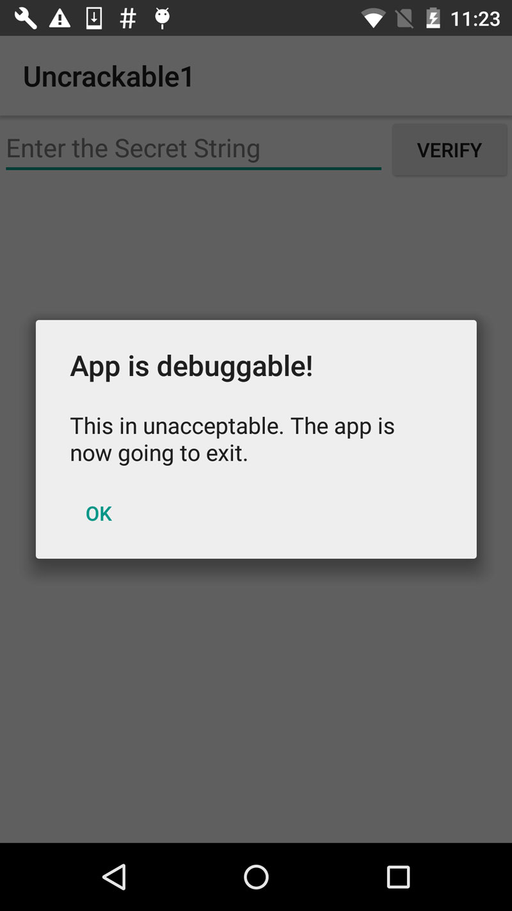

開発者オプションで, デバッグするアプリケーションとして `Uncrackable1` を選択し, "Wait for Debugger" スイッチを有効にする. 

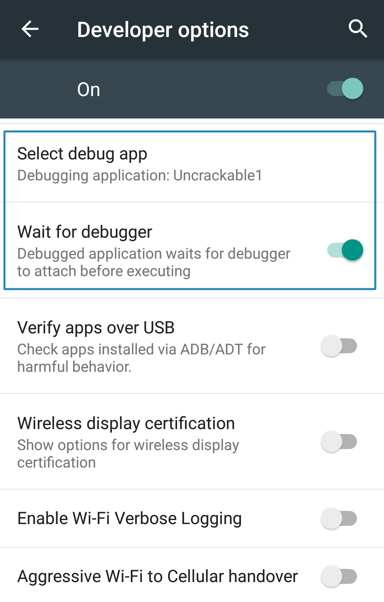

注意: `default.prop` に `ro.debuggable` が 1 にセットされていても, マニフェストで  `android:debuggable` フラグが `true` にセットされていない限り, アプリは "debug app" リストに現れない. 


##### Android デバッグブリッジ

Android SDK に付属している `adb` コマンドラインツールは, ローカル開発環境と接続された Android デバイス間のギャップを埋める. 

通常, エミュレータもしくは USB を介して接続されたデバイスでアプリのデバッグを行う. `adb devices` コマンドを使用することで, 接続されたデバイスをリストが表示される. 

```bash
$ adb devices
List of devices attached
090c285c0b97f748  device
```

The `adb jdwp` command lists the process ids of all debuggable processes running on the connected device 
`adb jdwp` コマンドは, 接続されたデバイスで実行している全てのデバッグ可能なプロセスのプロセス ID のリストを表示する(つまり, JDWP トランスポートをホストしているプロセス). `adb forward` コマンドを使用することで, ホストマシンで listen 状態のソケットを開き, ソケットの着信 TCP コネクションを選択されたプロセスの JDWP トランスポートへ転送することができる. 

```bash
$ adb jdwp
12167
$ adb forward tcp:7777 jdwp:12167
```

今, JDB をアタッチする準備が整った. しかしながら, デバッガをアタッチするとアプリが再開されるが, これは望ましくない. 初めに探索できるように, 中断された状態にしておきたい. プロセスが再開しないようにするために, jdb に `suspend` コマンドをパイプする. 

```bash
$ { echo "suspend"; cat; } | jdb -attach localhost:7777
Initializing jdb ...
> All threads suspended.
>
```

今, 中断されたプロセスにアタッチし, jdb コマンドを開始する準備が整った. `?` を入力することで, コマンドの完全なリストを表示することができる. 残念なことに, Android VM は利用可能な全ての JDWP 機能をサポートしているわけではない. たとえば, クラスコードを再定義できる `redefine` コマンドはサポートしてない. もう一つの重要な制限は, リリースバイトコードがライン情報を含んでいないため, ラインブレイクポイントが動作しない. しかしながら, メソッドブレイクポイントは動作する. 以下のような便利な操作コマンドを含んでいる: 

- *classes: ロードされたクラス全てのリストを表示する
- class/method/fields <class id>: クラスに関する詳細を表示し, メソッドとフィールドのリストを表示する
- locals: 現在のスタックフレーム内のローカル変数を表示する
- print/dump <expr>: オブジェクトに関する情報を表示する
- stop in <method>: メソッドブレイクポイントをセットする
- clear <method>: メソッドブレイクポイントを削除する
- set <lvalue> = <expr>:  新たな値を field/variable/array 要素に割り当てる

UnCrackable App Level 1 からデコンパイルされたコードを再考し, 可能な解決策に関して考えてみよう. 良いアプローチは, 秘密の文字列を読み取ることができるように, 平文で変数に保持されている状態でアプリを中断することである. 残念なことに, 初めに root/改ざん検知に対処しない限り, それを行うことはできない

コードを再調査すると, メソッド `sg.vantagepoint.uncrackable1.MainActivity.a` が, "This in unacceptable..." というメッセージボックスを表示していることを確認できる. このメソッドは, `AlertDialog` を生成し,  `onClick` イベントのためのリスナークラスをセットする. このクラス(`b` と名付けられた)には, ユーザが "OK" ボタンをタップするとすぐにアプリを終了させるコールバッグメソッドが実装されている. ユーザが単にダイアログをキャンセルできないようにするために, `setCancelable` メソッドが呼び出される. 

```java
  private void a(final String title) {
        final AlertDialog create = new AlertDialog$Builder((Context)this).create();
        create.setTitle((CharSequence)title);
        create.setMessage((CharSequence)"This in unacceptable. The app is now going to exit.");
        create.setButton(-3, (CharSequence)"OK", (DialogInterface$OnClickListener)new b(this));
        create.setCancelable(false);
        create.show();
    }
```

わずかな実行時の改ざんで, これをバイパスすることができる. まだアプリが中断している状態で, メソッドブレイクポイントを `android.app.Dialog.setCancelable` にセットし, アプリを再開する. 

```
> stop in android.app.Dialog.setCancelable
Set breakpoint android.app.Dialog.setCancelable
> resume
All threads resumed.
>
Breakpoint hit: "thread=main", android.app.Dialog.setCancelable(), line=1,110 bci=0
main[1]
```

今, アプリは `setCancelable` メソッドの最初の命令で中断される. `locals` コマンドを用いて `setCancelable` に引き渡された変数を表示することができる(変数は "local variables" の下に誤って表示される). 

```
main[1] locals
Method arguments:
Local variables:
flag = true
```

`setCancelable(true)` が呼び出されたため, これは我々が探している呼び出しではない. `resume` コマンドを用いてプロセスを再開させる. 

```
main[1] resume
Breakpoint hit: "thread=main", android.app.Dialog.setCancelable(), line=1,110 bci=0
main[1] locals
flag = false
```

今, 変数 `false` を用いて `setCancelable` への呼び出しに到達した. `set` コマンドを用いて変数を true にセットして再開する. 

```
main[1] set flag = true
 flag = true = true
main[1] resume
```

このプロセスを繰り返して, 最終的にアラートボックスが表示されるまで, ブレイクポイントに到達するたびに `flag` を `true` にセットする(ブレイクポイントは5回か6回到達するだろう). 今, アラートボックスはキャンセルできるようになっているはずだ. ボックスの隣にある画面をタップすると, アプリが終了することなくクローズするだろう. 

耐タンパーが片付いたので, 秘密の文字列を抽出する準備が整った. "静的解析" のセクションで, 文字列が AES を用いて復号され, その後メッセージボックスの入力文字と比較していることを確認した. 

`java.lang.String` クラスのメソッド `equals` は, 入力文字列と秘密の文字列を比較する. `java.lang.String.equals` 上でメソッドブレイクポイントを設定し, 編集フィールドに任意のテキスト文字列を入力し, "verify" ボタンをタップする. 

ブレイクポイントが到達したらすぐに, `locals` を用いてメソッド変数を読み込むことができる. 

```
> stop in java.lang.String.equals
Set breakpoint java.lang.String.equals
>    
Breakpoint hit: "thread=main", java.lang.String.equals(), line=639 bci=2

main[1] locals
Method arguments:
Local variables:
other = "radiusGravity"
main[1] cont

Breakpoint hit: "thread=main", java.lang.String.equals(), line=639 bci=2

main[1] locals
Method arguments:
Local variables:
other = "I want to believe"
main[1] cont     
```

これは探していた平文の文字列である. 


###### IDE を用いたデバッグ

デコンパイルされたソースを用いて IDE でプロジェクトをセットアップすることは, ソースコードに直接メソッドブレイクポイントをセットできるようになる巧妙な手段である. ほとんどの場合で, アプリを通してシングルステップで実行でき, GUI を用いて変数の状態を調査することができる. その認識は完ぺきではないだろう. 何しろそれはオリジナルのソースコードではないため, ラインブレイクポイントをセットすることができず, 単に正確に動作しないこともあるのだから. 

とはいっても, コードをリバーシングすることは決して簡単ではないし, プレーンオールド Java コードを効率的にナビゲートしデバッグすることは非常に便利な方法である. 同様のメソッドは, [NetSPI blog](https://blog.netspi.com/attacking-android-applications-with-debuggers/ "NetSPI Blog - Attacking Android Applications with Debuggers")で紹介されている. 

IDE デバッグをセットアップするために, 最初に IntelliJ でAndroid プロジェクトを作成し,  "Statically Analyzing Java Code" セクションで前述したように, ソースフォルダの中にでコンパイルされた Java ソースコードをコピーする. デバイスで, "Developer options" の "debug app" としてアプリを選択し(このチュートリアルの Uncrackable1), "Wait For Debugger" 機能がオンになっていることを確認する. 

ランチャーから Uncrackable アプリのアイコンをタップすると, "wait for a debugger" モードで中断する. 

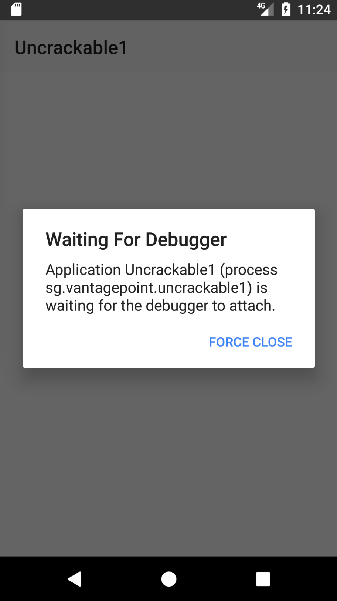

今, ブレイクポイントをセットし, "Attach Debugger" ツールバーボタンを用いて Uncrackable1 アプリのプロセスにアタッチすることができる. 


デコンパイルされたソースコードからアプリをデバッグするときは, メソッドブレイクポイントだけが動作することに注意すること.  メソッドブレイクポイントが到達すると, メソッド実行中にシングルステップ実行する機会を得る. 

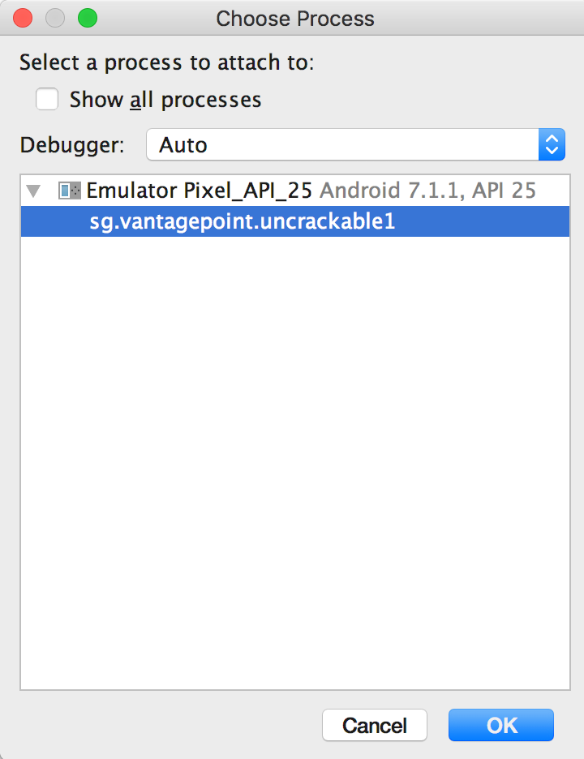

リストから Uncrackable1 アプリケーションを選択した後に, デバッガがアプリプロセスにアタッチし, `onCreate()` メソッドでセットされたブレイクポイントに到達するだろう. Uncrackable1 アプリは, `onCreate()` メソッドなしにアンチデバッグ制御や耐タンパー制御をトリガーする. そのため, 耐タンパーチェックやアンチデバッグチェックが実行される直前に `onCreate()` メソッドにブレイクポイントをセットすることは良い考えである. 

次に, デバッガビューで "Force Step Into" をクリックすることによって `onCreate()` メソッドをシングルステップ実行する. "Force Step Into" オプションは, 通常, デバッガによって無視されるAndroid フレームワーク関数とコア Java クラスをデバッグできるようにする. 

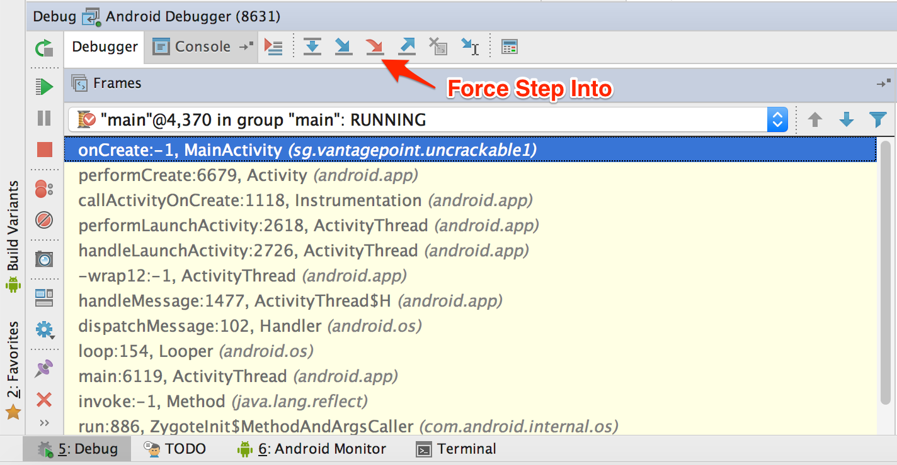

一度 "Force Step Into" すると, デバッガは次のメソッドの開始位置でストップする. その場所は, クラス `sg.vantagepoint.a.c` の `a()` メソッドである. 

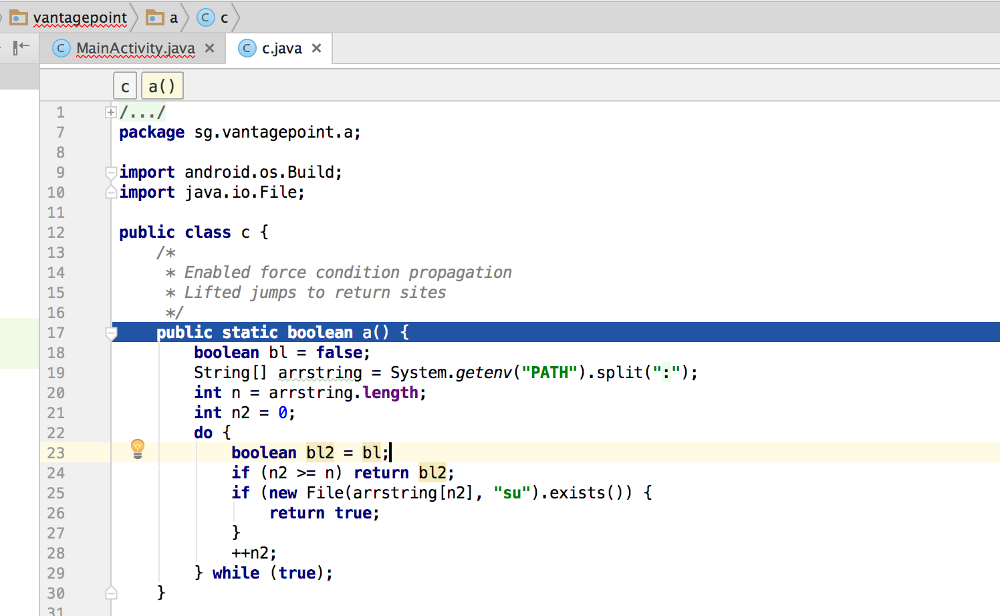

このメソッドはディレクトリ(`/system/xbin` など)のリストとともに "su" バイナリを調査する. ルート化されたデバイス/エミュレータでアプリを実行しているため, 変数か関数の返り値を操作してチェックを無効化する必要がある. 


デバッガビューの "Step Over" をクリックして `a()` メソッドにステップインして通り抜けることで, "Variables" ウインドウ内のディレクトリ名を確認することができる

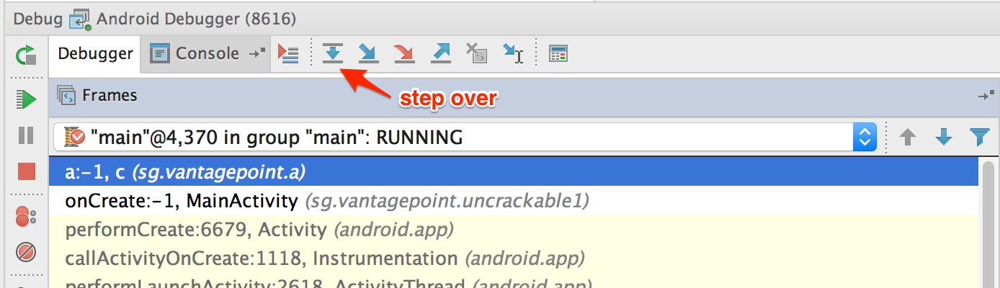

"Force Step Into" 機能を用いて `System.getenv` メソッドにステップインする. 

コロン (,) 区切りのディレクトリ名を取得した後, デバッガのカーソルは, 次の実行可能な行ではなく `a()` メソッドの開始に返る. これはソースコードの代わりにデコンパイルされたコード上で実行していることが原因で発生する. このスキップは, デコンパイルされたアプリケーションのデバッグに重要なコードフローに従う. 

コア Java や Android クラスをデバッグしたくない場合は, デバッガビューの "Step Out" をクリックすることで関数からステップアウトする. デコンパイルされたソースやコア Java 及び Android クラスの "Step Out" に到達した時点で "Force Step Into" を使用することが良い考えかもしれない. これは, コアクラス関数の返り値を監視している間, デバッグのスピードアップを手助けする. 


`a()` がディレクトリ名を取得した後, これらのディレクトリの中から `su` バイナリを検索する. このチェックを無効化するために, 検知メソッドをステップスルーし, 現在の変数を調査する. 実行が `su` バイナリを検知する場所に到達すると, F2を押すか右クリックして "Set Value" を選択することでファイル名やディレクトリ名を保持している変数の一つを改ざんする. 

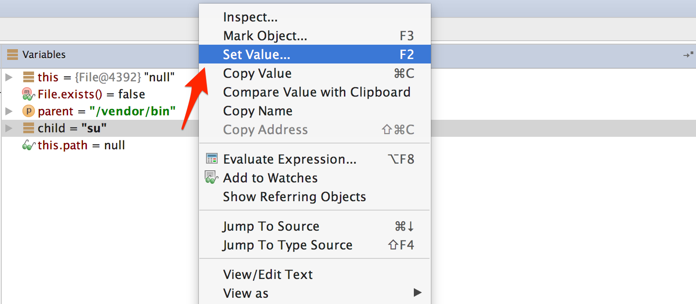

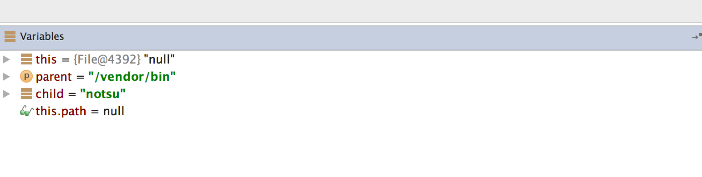

バイナリ名やディレクトリ名を改ざんしたら, `File.exists` は `false` を返すだろう. 


これは, Uncrackable App Level 1 に搭載されている最初のルート化検知制御の無効化である. 残りの耐タンパーやアンチデバッグ制御は, 最終的に秘密の文字列の検証機能に到達できるように, 同様の方法で無効化することができる. 

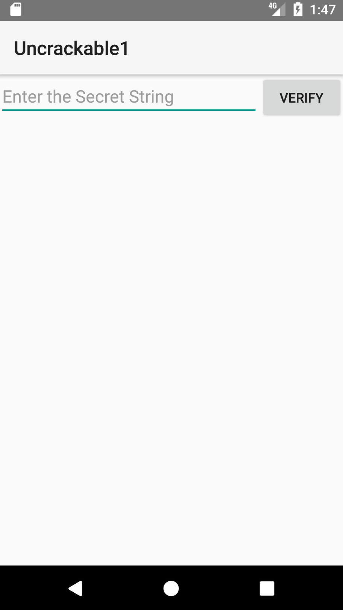

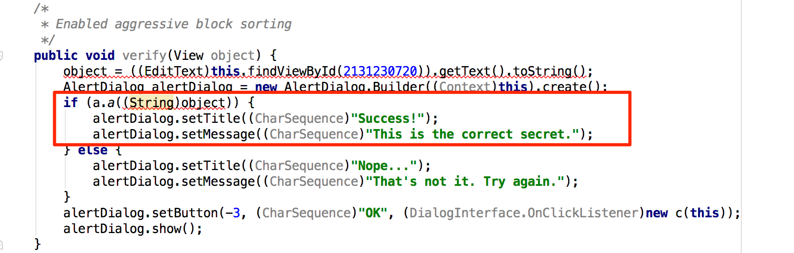

シークレットコードは, クラス `sg.vantagepoint.uncrackable1.a` のメソッド `a()` によって検証される. ブレイクポイントに到達したときに, メソッド `a()` や "Force Step Into" にブレイクポイントをセットする. その後, `String.equals` に呼び出しに到達するまでシングルステップ実行する. これは, ユーザ入力が秘密の文字列と比較される場所である. 


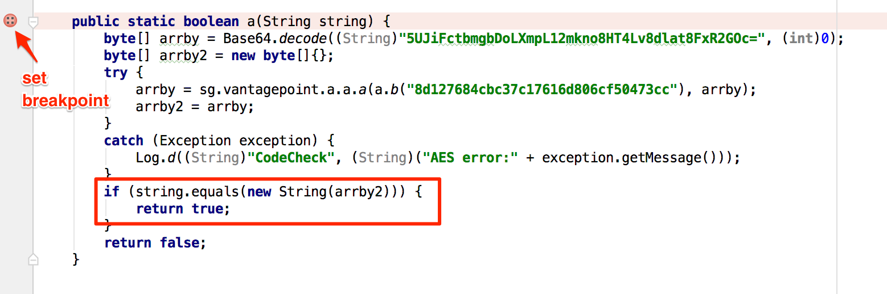

`String.equals` メソッド呼び出しに到達したとき, "Variables" ビューで秘密の文字列を確認することができる. 


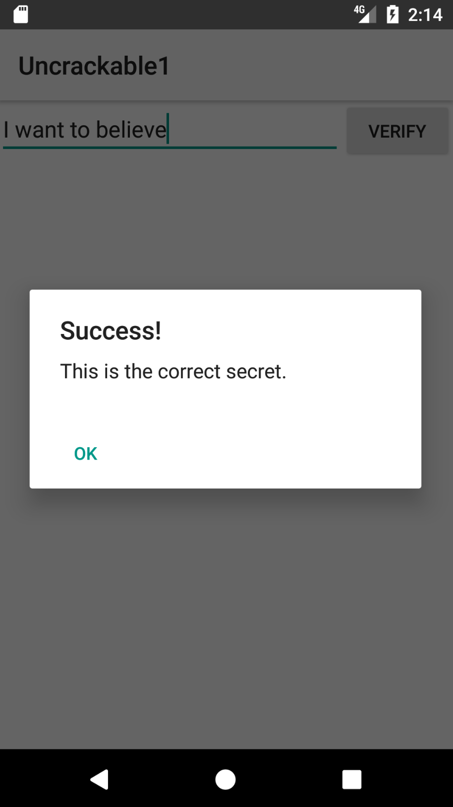


##### ネイティブコードのデバッグ

アンドロイドのネイティブコードは, ELF 共有ライブラリにパックされており, 他のネイティブの Linux プログラムと同様に実行される. それ故, デバイスのプロセッサアーキテクチャがサポートされているのであれば(ほとんどのデバイスは, ARM チップセットに基づいているため, 通常は問題ない), 標準ツール(GDB および, IDA Pro, JEB などのビルドイン IDE デバッガを含む)を用いてデバッグすることができる. 

デバッグするために, JNI デモアプリ(HelloWorld-JNI.apk)をセットアップしてみよう. これは, "Statically Analyzing Native Code" でダウンロードしたのと同じ APK である. `adb install` でデバイスやエミュレータにアプリをインストールする. 

```bash
$ adb install HelloWorld-JNI.apk
```

本章の初めの手順に従った場合, すでに Android NDK を手に入れているはずである. これには, 様々なアーキテクチャ用の gdbserver のあらかじめビルドされたバージョンが含まれている. デバイスに gdbserver のバイナリをコピーする. 

```bash
$ adb push $NDK/prebuilt/android-arm/gdbserver/gdbserver /data/local/tmp
```

`gdbserver --attach`commandは, gdbserver が実行中のプロセスにアタッチし, `comm` で指定されてた IP アドレスやポートにバインドする. この場合, HOST:PORT 記述子である. デバイスで, HelloWorld-JNI を起動し, 次にデバイスに接続して HelloWorld プロセスの PID を特定する. その後, root ユーザに切り替え, `gdbserver` をアタッチする: 

```bash
$ adb shell
$ ps | grep helloworld
u0_a164   12690 201   1533400 51692 ffffffff 00000000 S sg.vantagepoint.helloworldjni
$ su
# /data/local/tmp/gdbserver --attach localhost:1234 12690
Attached; pid = 12690
Listening on port 1234
```

プロセスが中断し, `gdbserver` は, `1234` ポートでクライアントのデバッグをリッスンする. USB を介して接続されたデバイスを用いて, `abd forward` コマンドでこのポートをホストのローカルポートに転送することができる. 

```bash
$ adb forward tcp:1234 tcp:1234
```

今, NDK ツールチェインに含まれた `gdb` のあらかじめビルドされたバージョンを使用することができるだろう(まだ使用できない場合は, 上述した手順に従ってインストールすること). 

```
$ $TOOLCHAIN/bin/gdb libnative-lib.so
GNU gdb (GDB) 7.11
(...)
Reading symbols from libnative-lib.so...(no debugging symbols found)...done.
(gdb) target remote :1234
Remote debugging using :1234
0xb6e0f124 in ?? ()
```

うまくプロセスにアタッチされている. 唯一の問題は, JNI 関数 `StringFromJNI` をデバッグするにはすでに遅すぎるということである. つまり, それは起動時に一度だけ実行される. "Wait for Debugger" オプションを起動することで, この問題を解決することができる. "Developer Options" → "Select debug app" と進み, HelloWorldJNI を選択し, 次に "Wait for debugger" スイッチを有効にする. その後, アプリを終了して再開する. アプリは自動的に中断されるはずだ. 

我々の目的は, アプリが再開する前にネイティブ関数 `Java_sg_vantagepoint_helloworldjni_MainActivity_stringFromJNI` の最初の命令でブレイクポイントをセットすることである. 残念ながら, `libnative-lib.so` はプロセスメモリ内にまだマッピングされていないため, 実行のこの時点では可能ではない. それは, 実行時に動的にロードされる. この作業をするために, 初めに JDB を使用してプロセスを望まれた状態に徐々に変更する. 

まず初めに, JDB にアタッチすることによって, Java VM の実行を再開する. プロセスをすぐに再開したくないので, JDB に `suspend` をパイプする. 

```bash
$ adb jdwp
14342
$ adb forward tcp:7777 jdwp:14342
$ { echo "suspend"; cat; } | jdb -attach localhost:7777
```

次に, Java ランタイムが `libnative-lib.so` をロードする場所のプロセスを中断する. JDBで, `java.lang.System.loadLibrary` メソッドにブレイクポイントをセットしてプロセスを再開する. ブレイクポイントが到達した後, `loadLibrary()` が返るまでプロセスを再開する `step up` コマンドを実行する. このポイントで, `libnative-lib.so` はロードされた. 

```
> stop in java.lang.System.loadLibrary
> resume
All threads resumed.
Breakpoint hit: "thread=main", java.lang.System.loadLibrary(), line=988 bci=0
> step up
main[1] step up
>
Step completed: "thread=main", sg.vantagepoint.helloworldjni.MainActivity.<clinit>(), line=12 bci=5

main[1]
```

`gdbserver` を実行し, 中断されたアプリにアタッチする. Java VM と Linux カーネル両方によって, アプリが中断させられるだろう("double-suspension" の状態が生成される). 


```bash
$ adb forward tcp:1234 tcp:1234
$ $TOOLCHAIN/arm-linux-androideabi-gdb libnative-lib.so
GNU gdb (GDB) 7.7
Copyright (C) 2014 Free Software Foundation, Inc.
(...)
(gdb) target remote :1234
Remote debugging using :1234
0xb6de83b8 in ?? ()
```

JDB で `resume` コマンドを実行し, Java ランタイムの実行を再開する(JDB で行われているので, デタッチすることもできる). GDB を用いてプロセスの調査を開始することができる. `info sharedlibrary` コマンドは, libnative-lib.so に含まれているロードされたライブラリを表示する. `info functions` コマンドは, 既知の関数の全てのリストを読み出す. JNI 関数 `java_sg_vantagepoint_helloworldjni_MainActivity_stringFromJNI` は, 非デバッグシンボルとしてリストに表示されるだろう. 関数のアドレスにブレイクポイントをセットし, プロセスを再開させる. 

```bash
(gdb) info sharedlibrary
(...)
0xa3522e3c  0xa3523c90  Yes (*)     libnative-lib.so
(gdb) info functions
All defined functions:

Non-debugging symbols:
0x00000e78  Java_sg_vantagepoint_helloworldjni_MainActivity_stringFromJNI
(...)
0xa3522e78  Java_sg_vantagepoint_helloworldjni_MainActivity_stringFromJNI
(...)
(gdb) b *0xa3522e78
Breakpoint 1 at 0xa3522e78
(gdb) cont
```

JNI 関数の最初の命令が実行されたときに, ブレイクポイントは到達するはずである. 今, `disassemble` コマンドを使用することで, 逆アセンブルされた関数のバージョンを表示することができる. 

```
Breakpoint 1, 0xa3522e78 in Java_sg_vantagepoint_helloworldjni_MainActivity_stringFromJNI() from libnative-lib.so
(gdb) disass $pc
Dump of assembler code for function Java_sg_vantagepoint_helloworldjni_MainActivity_stringFromJNI:
=> 0xa3522e78 <+0>: ldr r2, [r0, #0]
   0xa3522e7a <+2>: ldr r1, [pc, #8]  ; (0xa3522e84 <Java_sg_vantagepoint_helloworldjni_MainActivity_stringFromJNI+12>)
   0xa3522e7c <+4>: ldr.w r2, [r2, #668]  ; 0x29c
   0xa3522e80 <+8>: add r1, pc
   0xa3522e82 <+10>:  bx  r2
   0xa3522e84 <+12>:  lsrs  r4, r7, #28
   0xa3522e86 <+14>:  movs  r0, r0
End of assembler dump.
```

ここからは, プログラムをシングルステップ実行したり, レジスタやメモリの内容を表示したり, それらを改ざんしたりすることで, JNI 関数を調査することができる(この場合は, 単に文字列を返すだけである). `help` コマンドを使用することで, データのデバッグ, 実行, 検査に関するより多くの情報を取得することができる. 


