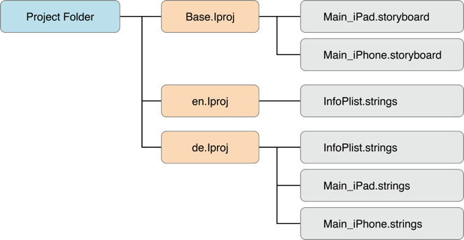

## iOS Platform Overview

iOS は Apple 社が提供している iPhone や iPad, iPod Touch といったモバイルデバイスに搭載されているモバイル向けOSである. この OS は Apple tvOS の基礎にもなっており, tvOS は iOS から多くの機能を継承している.

Apple 社のデスクトップ向け OS である macOS (以前で言う OS X)のように, iOS は, Apple 社が開発しているオープンソースの Unix 系の OS である Darwin をベースとしている. Darwin の kernel は XNU ("XNU: X is Not Unix")であり, Mach と FreeBSD カーネルのコンポーネントを組み合わせた, ハイブリッドなカーネルである.

しかしながら, iOS アプリケーションはデスクトップ対応のものよりも制限された環境で動作する. iOS アプリケーションでは, 各ファイルシステムレベルで分離されており, システム API アクセスにおいては特に制限されている.

悪意のあるアプリケーションからユーザを保護するため, Apple は iOS デバイス上で動作することが許可されているアプリケーションへのアクセスを制限, 制御している. Apple App Store は唯一の公式なアプリケーション配布プラットフォームである. 開発者は自身のアプリケーションを提供でき, 消費者(consumers: ユーザにする？)はアプリケーションの購入, ダウンロード, インストールを行うことができる. この配布方法は Android と異なっており, いくつかの app store とサイドローディング(sideloading: 公式である App Store を使わずにアプリケーションを iOS デバイスへインストールすること)をサポートしている.

以前, サイドローディングは jailbreak した端末か, 複雑な制限の回避を行った場合にのみ可能だった. iOS 9 以降では, Xcode 経由での[サイドロード](https://www.igeeksblog.com/how-to-sideload-apps-on-iphone-ipad-in-ios-10/ "How to Sideload Apps on iPhone and iPad Running iOS 10 using Xcode 8")が可能となっている.

iOS アプリケーションは Apple sandobox(歴史的には Seatbelt と呼ばれている技術) によってそれぞれ分離されており, 強制アクセスコントロール( MAC: mandatory access control) 機構に, アプリケーションがリソースへのアクセス権を有しているかどうかが記述されている.**←訳なんか微妙, ここ確認**
Android の外部プロセス間通信機構と比べると iOS が提供している IPC のオプションは非常に少なく, 潜在的な攻撃面(Attack surface)を少なくなっている.

一様なハードウェアや密接なハードウェア/ソフトウェアの統合は他のセキュリティ的な利点を生み出す. 各 iOS デバイスは, セキュアブート(secure boot)やハードウェアで保護されたキーチェーン(hardware-backed keychain), 暗号化されたファイルシステムなどのセキュリティ機能を提供している. iOS アップデートはたいてい迅速に多くのユーザで実施され, サポートの必要がある古いバージョンや保護されていない iOS のバージョンを減らしている.

iOS 多くの強みにも関わらず, iOS アプリケーションの開発者はまだセキュリティについて心配する必要がある. データの保護やキーチェーン, TouchID 認証, ネットワークセキュリティはいまだエラーの多くのマージンを占めている. 次章では, iOS セキュリティアーキテクチャを述べ, 基本的なセキュリティテスティングの方法論を説明し, リバースエンジニアリングのハウツーを提供する(and provide reverse engineering how-tos: <\-微妙, 修正したい).


### iOS Security Architecture

iOS セキュリティアーキテクチャ([iOS security architecture](https://www.apple.com/business/docs/iOS_Security_Guide.pdf "Apple iOS Security Guide"))は 6 つのコアな機能で構成されている.

6 つのコアな機能:

- ハードウェアセキュリティ機能(Hardware Security)
- セキュアブート機能(Secure Boot)
- コード署名機能(Code Signing)
- サンドボックス機能(Sandbox)
- 暗号化およびデータ保護機能(Encryption and Data Protection)
- 汎用的なエクスプロイト緩和機能(General Exploit Mitigations)


- ***iOS Security Architecture***

#### Hardware Security

iOS セキュリティアーキテクチャは全体的なパフォーマンスを向上させる(ため？)ハードウェアベースのセキュリティ機能を利用している. 各 iOS デバイスには, 製造時にアプリケーションプロセッサと Secure Enclave に焼き付け, あるいはコンパイルされた 2 つのAES 256 bit 鍵(GID, UID)が組み込まれている. これらはソフトウェアや JTAG のようなインターフェースデバッグツールで直接読み出すことはできない. それらの鍵には, 暗号化および復号時にハードウェアの AES 専用エンジンによってのみ例外的にアクセス, 操作される.

GID の値はデバイスの特定クラスの全プロセッサで共通であり, ファームウェアファイルの改ざん防止やユーザのプライベートなデータと直接関係のない暗号学的なタスクに使用される. UID は各デバイスでユニークであり, デバイスレベルでのファイルシステム暗号化で鍵階層を保護する際に使用される(関連付けられている？UIDs, which are unique to each device, are used to protect the key hierarchy that's used for device-level file system encryption). UID は製造中にレコードされないため, Apple でさえ特定のデバイスについてファイル暗号鍵を復元することはできない.

フラッシュメモリ上のセンシティブなデータに対してセキュアな削除を行うため, iOS デバイスは [Effaceable Storage](https://www.apple.com/business/docs/iOS_Security_Guide.pdf "iOS Security Guide") と呼ばれる機能を持っている. この機能はストレージ技術へ低レイヤでの直接アクセスを提供しており, 選択されたブロックをセキュアに消去することができる.

#### Secure Boot

iOS デバイスの電源を入れた際, はじめに読出専用の Boot ROM から即座にシステムを起動する最初の命令を読み出す.
Boot ROM は変更不可のコードと Apple の Root CA(ルート証明書の公開鍵)を含んでいる(ルート証明書はコード内に含まれている). これらは製作時にシリコンの die(半導体チップ)に書き込まれており, これによって信頼される.
次に, Boot ROM は iBoot ブートローダの署名が正しいか確認する.
署名が有効な場合, iBoot はブートステージの次に iOS カーネルの署名をチェックする.
これらのステップが一つでも失敗した場合, ブートプロセスは即座に終了し, デバイスではリカバリーモードが起動され"Connect to iTunes(iTunesに接続)"画面が表示される.
しかし, Boot ROM がロードに失敗した場合(Boot ROM による LLB(Low-level Bootloader)の読み込み/検証が失敗した場合), デバイスは DFU(Device Firmware Upgrade) と呼ばれる low-level でのリカバリモードを起動する.
これは, デバイスの初期化を行う最後の手段である.
このモードでは, デバイスは動作している兆候は見せない. 言い換えれば, スクリーンには何も表示されない.

この全体のプロセスは"Secure Boot Chain"と呼ばれる.
その目的はシステムやそのコンポーネントが Apple によって記述, 提供されていることを検証することである.
Secure Boot Chain はカーネルやブートローダ, カーネル拡張, ベースバンドファームウェアを含んでいる.

#### Code Signing(コード署名)

Apple は彼らのデバイス上では Apple が認めたコードのみが実行されることを保証するため, 精巧な DRM(Digital Right Management: デジタル著作権管理) システムを実装している.
言い換えれば, Jailbreak (脱獄)されていない iOS デバイス上では, Apple が特別に許可していなければいかなるコードも実行させることはできない.
エンドユーザは公式の Apple App Store を通じてのみ, アプリをインストールすると想定されている.
そのため, iOS は水晶の牢獄(crystal prison)と比較されたことがある(["Apple's Crystal Prison and the Future of Open Platforms"](https://www.eff.org/deeplinks/2012/05/apples-crystal-prison-and-future-open-platforms).
開発者のプロファイルおよび Apple が署名した証明書が, デプロイとアプリケーションの実行の際に必要となる.
開発者は Apple に登録し, [Apple Developer Program](https://developer.apple.com/support/compare-memberships/ "Membership for Apple Developer Program")に参加する必要があり, 全ての開発とデプロイの権利(possibilities)を取得するために年間登録料を支払う必要がある.
アプリのコンパイルやサイドローディングによるデプロイ(App Storeからは配布されない)を許可している無償のアカウントも存在する.

#### Encryption and Data Protection(暗号化とデータの保護)

*FairPlay コード暗号化(FairPlay Code Encryption)*は, App Store からダウンロードされたアプリに適用される.
FairPlay は iTunes で購入されたマルチメディアコンテンツの DRM として開発された.
元々は, Fairplay 暗号化(Fairplay encryption)は MPEG と QuickTime ストリームに適用されていたが, 同様の基本概念は実行ファイルにも適用可能だった.

基本的なアイデアは次のようなものだ: 新しい Apple アカウントを作成した際, 公開鍵と秘密鍵のペアが作成され, アカウントに紐づけられる.
秘密鍵はデバイス上に安全な形で保存される.
これは, FairPlayによって暗号化されたコード(FairPlay-encrypted code)はアカウントに紐づいたデバイスでのみ復号可能であることを意味している -- TODO [Be more specific] --.
FairPlay 暗号化データの解析(Reverse FairPlay encryption)はたいてい, アプリが動作しているデバイスを入手し, メモリから復号されたコードをダンプすることで取得される(後述の "iOS における基本的なセキュリティテスト(Basic Security Testing on iOS)"を参照してほしい).

Apple は iPhone 3GS のリリース以来, iOS デバイスのハードウェアとファームウェアに暗号化手法を組み込んでいる.
全デバイスには専用のハードウェアベースでの 256 bit AES 暗号化エンジンがあり, 暗号学的ハッシュ関数の SHA-1 と組み合わせて動作する.
加えて各デバイスのハードウェアには固有識別子(UID)が組み込まれており, アプリケーションプロセッサに AES 256 bit 鍵として埋め込まれている.***←ここ訳微妙？***
この UID は固有であり, 他の場所には記載されていない.
(原文の)執筆時点では, ソフトウェアもファームウェアも直接 UID を読み込むことはできない.
鍵はシリコンチップに焼きこまれているため, 改ざんや回避を行うことはできない.
その鍵には暗号化エンジンのみがアクセス可能である.

物理アーキテクチャに設けられた暗号化機構は, すべてのデータを暗号化した状態で iOS デバイスに保存することを可能とするデフォルトのセキュリティ機能である.
結果として, データ保護はソフトウェアレベルで実装され, より安全な環境を提供するためハードウェアとファームウェアレベルでの暗号化が適用される.

データ保護が有効になっている場合, 各データファイルは特定のクラスに関連付けられる.
各クラスは異なるレベルのアクセシビリティをサポートし, データへのアクセスが発生するタイミングに基づいて, データを保護する.
各クラスに紐づけられた暗号化/復号処理は, デバイスの UID とパスコード, クラスキー(class key), ファイルシステムキー(file system key), ペアファイルキー(per-file key)を利用した複数の鍵メカニズムに基づいている.
per-file key はファイルのコンテンツを暗号化するのに使用される.
クラスキーは per-file key にラップされ, ファイルのメタデータに格納される.
ファイルシステムキーはメタデータの暗号化に使用される.
UID およびパスコードはクラスキーに保護される.
この操作はユーザからは不可視である.
データ保護を有効にするためには, デバイスを使用する際にパスコードが使用されている必要がある.
パスコードはデバイスのロック解除に使用される.
UID と組み合わせて, パスコードはよりハッキングや総当たり攻撃に対して堅牢にする iOS 暗号化鍵を生成する.
データ保護の有効化がユーザにパスコードを使用させる主な理由である.

#### Sandbox

[appsandbox](https://developer.apple.com/library/content/documentation/FileManagement/Conceptual/FileSystemProgrammingGuide/FileSystemOverview/FileSystemOverview.html "File System Basics")は iOS のアクセス制御技術である.
これはカーネルレベルで施されている.
その目的は, アプリが侵害された際に発生しうるユーザデータへの被害を軽減するためである.
サンドボックス化は iOS の初期リリースからコアなセキュリティ機能として提供されている.
全サードパーティアプリは同一ユーザ(`mobile`)下で実行され, いくつかのシステム関連のアプリケーションおよびサービスのみ`root`として実行される.

通常の iOS アプリはコンテナ(*container*)に閉じ込められ, アクセスが自身のファイルや極めて少ない数のシステム API に制限される.
全てのリソース(ファイル, ネットワークソケット, IPCや共有メモリ(shared memory))へのアクセスは, サンドボックスによって制御される.
それらの制限は次のように動作している [#levin]: 
- アプリのプロセスは chroot に似たプロセスのため自身のディレクトリ(/var/mobile/Containers/Bundle/Application/ 以下)に制限される.
- システムコールの `mmap` および `mmprotect`(mprotect?) は, アプリによる書き込み可能かつ実行可能なメモリページ作成や停止, プロセスが動的に生成したコードの実行を妨げるために定義されている.
  コード署名と FairPlay の組み合わせにより, これはコードが特定の状況下でのみ実行されるよう厳密に制限する(言い換えれば, app store で配布された配信されているアプリ内のすべてのコードは Apple に認可されている).
- プロセスは, たとえ同じ UID を持っていたとしても, それぞれ分離される.
- ハードウェアドライバは直接アクセスできない. 代わりに, Apple のフレームワークを通じてアクセスしなければならない.

#### General Exploit Mitigations(汎用的なエクスプロイト軽減策)

iOS ではコード実行による攻撃を軽減するため, アドレス空間配置のランダム化(ASLR)と eXecute Never(XN) bit が実装されている.
ASLR はプログラムが実行されるたびに, プログラムの実行ファイルやデータ, ヒープ, スタックのメモリ配置をランダムにする.
共有ライブラリは複数のプロセスからアクセスされることから静的である必要があるため, 共有ライブラリのアドレスは, プログラムが呼び出される時の代わりに OS がブートされるたびにランダム配置される.
これは特定の関数, ライブラリのメモリアドレスを予測することは難しくなり, それによって return-to-libc 攻撃, 基本的な libc 関数のメモリアドレスを必要とする , のような攻撃を防ぐ.***←ここ訳微妙？***

iOS は XN 機能によって, プロセスのメモリセグメントを実行不可能としてマークすることができる.
iOS 上では, ユーザモードプロセスのプロセススタックおよびヒープは実行不可能としてマークされている.
書き込み可能なページでは, 同時に実行可能とマークすることはできない.
これによって, 攻撃者がスタックやヒープに注入した機械語を実行することを防いでいる.

### Software Development on iOS(iOSでのソフトウェア開発)

他のプラットフォームのように, Apple は開発者が開発, ネイティブな iOS アプリのインストール, 実行, テストの助けとなるソフトウェア開発キット(SDK)を提供している.
Xcode は Apple 開発者のための統合開発環境(IDE: Integrated Development Environment)だ.
iOS アプリケーションは Objective-C あるいは Swift で記述される.

Objective-C は C 言語に Smalltalk スタイルのメッセージングを加えたオブジェクト指向のプログラミング言語だ.
この言語は macOS のデスクトップアプリケーションと iOS 上で動くモバイルアプリケーションの開発で使用される.
Swift は Objective-C の後継で, Objective-C と互換性がある.

Swift は 2014 年に Xcode 6 とともに導入された.

Jailbreak されていないデバイスでは, App Store を使わずにアプリケーションをインストールするには 2 つの方法がある
1. エンタープライズモバイルデバイス管理から行う. この方法では Apple によって署名された企業の証明書が必要.
2. サイドローディングから行う, つまり, 開発者の証明書で署名されたアプリを Xcode からデバイスにインストールする
3. 限られた数のデバイスのみ, 同じ証明書でインストール可能

### Apps on iOS(iOS 上で動作するアプリ)

iOS アプリは IPA(iOS App Store Package) アーカイブとして提供される.
IPA ファイルはアプリを実行するために必要なすべてのコードとリソースを含んだ ZIP 圧縮のアーカイブである.
IPA ファイルはビルトインのディレクトリ構造を有している.
例ではこの構造の上層部分を示している:
- `/Payload/` フォルダは全アプリケーションデータを含む. このフォルダにあるコンテンツの詳細は後ほど言及する.
- `/Payload/Application.app` はアプリ自身(ARM 向けにコンパイルされたコード)とと静的なリソースに関連づけられたアプリケーションデータを含んでいる.
- `/iTunesArtwork` はアプリケーションアイコンで使用されている 512x512 ピクセルの PNG イメージである.
- `/iTunesMetadata.plist` には, 開発者の名前や開発者の ID, バンドルの識別子, コピーライト, アプリのジャンルや名前, リリース日, 購入日など色々な情報が含まれている.
- `/WatchKitSupport/WK` は拡張バンドルの一例である. この特定のバンドルは, Extension の delegate と, インターフェースを管理して Apple Watch のユーザインタラクションに応答するためのコントローラを含んでいる.

#### IPA Payloads - A Closer Look(IPA ペイロードをもっと見る)

IPA コンテナの変わったファイルをもっとよく見てみよう.
Apple は, ディスク容量を節約し, かつファイルアクセスを単純化するために, 無関係なディレクトリを極力無くした比較的フラットな構造を採用している.
バンドルディレクトリの上層には, アプリケーションの実行ファイルやアプリケーションが使用する全リソース(例えば, アプリケーションのアイコン, その他の画像, ローカライズされたコンテンツ)が存在する.

- **MyApp**: コンパイルされた(可読性のない)アプリケーションのソースコードを含んだ実行ファイル.
- **Application**: アプリケーションのアイコン.
- **Info.plist**: バンドル ID, バージョン番号, アプリケーションの表示名などの設定情報.
- **Launch images**: アプリケーション起動時に表示される画像. システムはアプリケーションが完全にロードされるまで一時的な背景として,保存されている起動用アイコンの一つを使用する.
- **MainWindow.nib**: アプリケーションが実行された時に読み込まれるデフォルトのインターフェースオブジェクト. 他のインターフェースオブジェクトは nib ファイルから読み込まれるか, アプリケーションによってプログラム的に生成される.
- **Settings.bundle**: Setting (設定)アプリで表示されるアプリ固有の Preference (設定).
- **Custom resource files**: ローカライズされないリソースは上層のディレクトリに保存され, ローカライズされるリソースはアプリケーションバンドルの言語ごとに指定されたサブディレクトリに保存される. リソースにはアプリケーションが使用する nib ファイル, 画像, 音声ファイル, 設定ファイル, strings ファイルや他のカスタムデータファイルが含まれる.

language.lproj フォルダはアプリケーションがサポートしている言語の分, 存在する. フォルダには storyboard や strings ファイルがある.
- storyboard は iOS アプリケーションにおけるユーザインターフェースの可視化表現である. storyboard では画面やそれぞれの画面とのつながりが可視化される.
- strings ファイルフォーマットは, ひとつあるいは複数の key-value ペアとオプショナルなコメントが含まれている.


- *iOS App Folder Structure(iOS アプリのフォルダ構造)*

Jailbreak されたデバイスでは, [IPA Installer](https://github.com/autopear/ipainstaller "IPA Installer") を使用することでインストールされた IPA ファイルを取り出すことができる.
モバイルセキュリティ診断では, 開発者から直接 IPA ファイルを受け取ることが多い.
開発者は, 実物を送るか彼らが使用している開発者独自の配布プラットフォーム(具体的には, [HockeyApp](https://hockeyapp.net/ "HockeyApp") か [Testflight](https://developer.apple.com/testflight/ "Testflight"))へアクセスさせてくれる.

#### App Structure on the iOS File System

iOS 8 から実装されたもので, 変更後のデバイスにアプリケーションを保存する方法がある.
以前アプリケーションは `/var/mobile/applications/` ディレクトリ内に展開されていた.
アプリケーションは 128 bit の値である UUID(Universal Unique Identifier) で識別され, この値はアプリケーション名のフォルダ内に保存されていた.
静的なバンドルとアプリケーションデータのフォルダは別の場所に保存されるようになった.
以下のフォルダはモバイルセキュリティ診断を行う上で説明が必須な情報を含んでいる

- `/var/mobile/Containers/Bundle/Application/[UUID]/Application.app` は前述の application.app のデータを含んでおり, アプリケーションの ARM 向けにコンパイルされたバイナリのような静的なコンテンツが保存されている.
このフォルダのコンテンツはコード署名の検証に使用される.
- `/var/mobile/Containers/Data/Application/[UUID]/Documents` にはユーザが生成する全てのデータが保存される. アプリケーションの使用者がこのデータを作成する.
- `/var/mobile/Containers/Data/Application/[UUID]/Library` は, キャッシュ, プリファレンス(preferences), Cookie やプロパティリスト(plist)設定ファイルのようなユーザに依存しないすべてのファイルが保存される.
- `/var/mobile/Containers/Data/Application/[UUID]/tmp` にはアプリケーションが起動姉弟間は必要ないテンポラリファイルが含まれる.

以下の図はアプリケーションフォルダの構造を示している.


- *iOS App Folder Structure*

#### The Installation Process(インストールプロセス)

iOS デバイスに IPA パッケージをインストールする方法には複数ある.
もっとも簡単な方法は iTunes 経由である. iTunes は Apple 純正のメディアプレイヤーである.
iTunes は macOS と Windows で使用できる.
ユーザは iTunes を使用して App Store からアプリケーションをダウンロードし, iOS にインストールできる.
iTunes を使用して IPA をインストールすることも可能だ([iTunes to install an IPA file to a device](https://www.youtube.com/watch?v=nNn85Qvznug "How to install an app via iTunes")).

Linux では, [libimobiledevice](http://www.libimobiledevice.org/ "libimobiledevice") - クロスプラットフォームなソフトウェアプロトコルライブラリで, iOS デバイスとネイティブな通信を行うためのツールセット - を使用できる.
ideviceinstaller を使用することで USB 通信経由でパッケージをインストールすることができる.
接続は USB 通信の多重化デーモン(USB multiplexing daemon) である  [usbmuxd](https://www.theiphonewiki.com/wiki/Usbmux "Usbmux") で実装されている. これは USB 上で TCP チャネル(a TCP tunnel over TCP)を提供する.

iOS 上において, 実際のインストールプロセスは installd デーモンによってハンドリングされ, アプリケーションが展開, インストールされる.
iOS 上でアプリのサービスが統合される, あるいはインストールされるためには, すべてのアプリケーションが Apple が発行した証明書で署名されなければならない.

これはアプリケーションがコード署名の検証成功後にのみ, インストールされることを意味する.

しかし Jailbreak された端末上では, [AppSync](http://repo.hackyouriphone.org/appsyncunified) でこのセキュリティ機構を迂回でき, Cydia store からパッケージを利用できる.
Cydia は公式のものとは別の app store で, Jailbreak で得られた root 権限を活用した, 高度な機能を実行する有用なアプリケーションを多く提供している.
AppSync は installd に適用される調整役で, 偽の署名付き IPA パッケージのインストールを行えるようにしてくれる.

IPA ファイルはコマンドラインから [ipainstaller](https://github.com/autopear/ipainstaller "IPA Installer") を使用して直接インストールすることも可能だ.
使用するデバイスに, 例えば scp(secure copy) などで, IPA ファイルをコピーしたのち, IPA ファイル名を指定して ipainstaller を実行すれば良い.

```bash
$ ipainstaller App_name.ipa
```

#### App Permissions(アプリの権限)

Android アプリとは対照的に, iOS アプリは前もってパーミッションが設定されない.
代わりに, ユーザは実行時 - アプリがセンシティブな API を使用しようとする最初の時 - に使用の許可について質問される.***←ここ訳微妙？***
パーミッションが付与されたアプリは Settings(設定) > Privacy(プライバシー) メニューに一覧化されており, ユーザはアプリごとに設定の変更を行える.
Apple はこのパーミッションの概念は [privacy controls](https://support.apple.com/en-sg/HT203033 "Apple - About privacy and Location Services in iOS 8 and later") と呼んでいる.

iOS 開発者はセンシティブな API を使用する際に必要なパーミッションを直接設定することはできず, 間接的に要求する.
例えば, ユーザの連絡先にアクセスする際には, CNContactStore がコールされユーザが連絡先へのアクセス権限を付与するか否認するか質問されている間アプリはブロックされる.
iOS 10.0 から実装されたものとして, アプリがどのようなデータにアクセスを行うのか(たとえば NSContactsUsageDescription) の目的説明のキーを含まなければならない, というものがある.

以下はユーザの許可が必要な [API](https://www.apple.com/business/docs/iOS_Security_Guide.pdf "iOS Security Guide. Page 71") である.

- Contacts
- Microphone
- Calendars
- Camera
- Reminders
- HomeKit
- Photos
- Health
- Motion activity and fitness
- Speech recognition
- Location Services
- Bluetooth sharing
- Media Library
- Social media accounts
